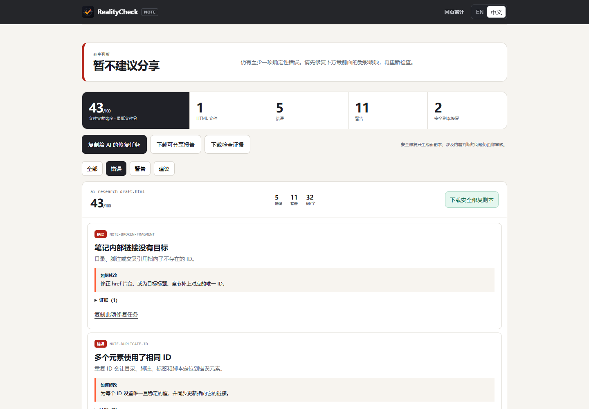

<div align="center">
  
</div>

<div align="center">

# RealityCheck

**Drop the AI export ZIP. Get a verified publish package—or exact blockers, never a fake green check.**

Check whether an HTML note is truly portable, and whether a Web UI survives real browser conditions.

[中文文档](docs/README.zh-CN.md) · [Try the HTML note checker](https://kevinwithpanda.github.io/RealityHTMLCheck/note.html) · [Inspect reproducible note evidence](https://kevinwithpanda.github.io/RealityHTMLCheck/compatibility.html) · [Open a real Web report](https://kevinwithpanda.github.io/RealityHTMLCheck/reference/report.html)

[](https://github.com/KevinwithPanda/RealityHTMLCheck/actions/workflows/validate.yml)
[](https://github.com/KevinwithPanda/RealityHTMLCheck/actions/workflows/pages.yml)
[](LICENSE)


</div>

> **Opens locally ≠ portable. Compiles ≠ works for users.**

RealityCheck is a local-first checker, Codex Skill, and evidence-first Web audit tool for the gap between valid HTML and usable HTML.

## Two problems worth solving

### 1. HTML notes that look finished but are not shareable

AI agents and export tools increasingly produce research notes, tutorials, reports, and knowledge pages as `.html`. A browser may open the file successfully while important failures remain hidden:

- images, styles, attachments, or linked notes exist only on the author's computer;
- Windows paths fail on macOS/Linux, or filename case changes break after deployment;
- a table of contents points to missing or duplicate anchors;
- Chinese, emoji, or symbols reopen with damaged encoding;
- scripts and remote dependencies make a supposedly local note execute code or contact a server;
- fixed-width layouts, long strings, missing viewport metadata, or weak structure make the note hard to read and reuse.

RealityCheck checks the **whole note folder**, not just one HTML string. Its 32 deterministic HTML rules cover integrity, structure, navigation, attachments, portability, readability, accessibility markup, unsafe behavior, and unfinished AI placeholders. Package-level analysis additionally follows reachable external CSS imports and assets, checks CSS path case/backslashes, and verifies cross-note fragments.

### 2. Cross-platform Web failures hidden by the happy path

A compiler can confirm syntax. A unit test can confirm a function. Neither proves that a page still works on a 320 px screen, with long content, RTL text, a missing image, keyboard navigation, zoom, an empty API response, or a slow/failed request.

RealityCheck's Web mode opens real isolated browser contexts and records what changes under controlled scenarios:

- phone/tablet viewports, horizontal overflow, touch-target sizing, and fixed layouts;
- long text, RTL, 200% zoom, keyboard access, reduced motion, and declared dark scheme;
- broken images, empty data, slow APIs, simulated 503 recovery, console and network failures;
- accessibility checks, performance budgets, link integrity, publishing metadata, security headers, and aggregate browser-storage privacy budgets;
- multi-page safe crawl, declarative journeys, visual baselines, policy gates, and before/after verification.

Unsupported or skipped coverage stays visible. It is never converted into a fake pass.

## Why this is not another HTML linter

| | Compiler / linter | General AI review | RealityCheck |
| --- | --- | --- | --- |
| Syntax and markup hints | Yes | Usually | Yes |
| Verify local images, attachments, linked notes, and path case | Rarely | Only if every file is supplied and inspected | **Folder-aware** |
| Reproduce responsive, content, keyboard, and network conditions | No | Usually simulated in text | **Real browser scenarios** |
| Keep measured evidence and stable finding IDs | No | Inconsistent | **HTML + JSON + screenshots** |
| Repair inside Codex and rerun the same check | No | Possible, but ad hoc | **Defined Skill workflow** |
| Prove a finding stopped reproducing without hiding known debt | No | Rarely | **Before/after verification** |

The innovation is the closed loop:

```text
inspect the real artifact → expose hidden failure → explain the evidence
→ repair a separate copy → rerun the same detector → deliver proof
```

It complements compilers and AI models rather than competing with them. The model supplies judgment where judgment is necessary; deterministic checks and browser evidence prevent confident guesses from becoming the quality gate.

<p align="center">
  
</p>

The public evidence is deliberately layered: four checked-in HTML files were emitted and byte-for-byte reproduced with **Pandoc 3.8.2.1** from four allowlisted commands—standalone, embedded local resources, TOC/footnotes/MathML, and multi-source composition. All four currently score 100/100. Seven separately labelled `-like` packages exercise representative failure shapes. Neither layer is presented as official or universal vendor compatibility. [Inspect the real-export manifest, hashes, findings, commands, and boundaries.](https://kevinwithpanda.github.io/RealityHTMLCheck/compatibility.html)

## Use it as software or as a Codex Skill

| Experience | Best for | What happens |
| --- | --- | --- |
| [Online note checker](https://kevinwithpanda.github.io/RealityHTMLCheck/note.html) | Anyone with an HTML export ZIP, file, or folder | Zero install/upload; verified ZIP import, local inspection, repeat-check comparison, and a structure-preserving safe-metadata ZIP |
| GitHub-backed `npx` CLI | Repeatable exports without cloning this repository | Check or build a verified static publish capsule with bilingual reports and exact browser evidence |
| GitHub Action | Export and publishing pipelines | Checks a note folder without a server, uploads the generated report, annotates exact files, and enforces error/warning gates |
| `$realitycheck` Skill | End-to-end work in Codex | Inspect, create a working copy, repair high-confidence issues, recheck, and return the usable output plus both reports |

### The end-to-end Skill workflow

Install the Skill once from a clone of this repository:

```bash
git clone --depth 1 https://github.com/KevinwithPanda/RealityHTMLCheck.git
cd RealityHTMLCheck
python scripts/install-skill.py
python scripts/install-skill.py --status
```

Reload Codex if necessary, then ask once:

```text
Use $realitycheck to check and repair this HTML note folder.
Do not overwrite the originals. Return the technical report,
the repaired usable HTML folder, the after report, and anything
that could not be fixed without inventing content.
```

That one request authorizes edits to a **new working copy**. The Skill first copies the bounded note bundle with its local images, styles, attachments, and linked notes into the evidence run, applies the three safe metadata repairs, lets Codex repair justified findings directly, reruns the same note check, and returns:

1. the before technical report;
2. the repaired HTML file or self-contained folder;
3. the after technical report;
4. a concise change list and unresolved decisions.

There is no need to copy a prompt from the report back into the same Codex task. Missing source material, factual descriptions, citations, or ambiguous interactive behavior are not fabricated to create a perfect score.

For a Web project:

```text
Use $realitycheck on this app. Find the real UI breakages,
fix the high-confidence major ones, and prove every fix.
```

For inspection only:

```text
Use $realitycheck to audit this app. Do not modify source.
```

## Try it in one minute

### No-install HTML note check

Open the [online checker](https://kevinwithpanda.github.io/RealityHTMLCheck/note.html) and choose the original export `.zip`, one `.html`, or the complete note folder. No manual ZIP extraction is required. The selected content is not uploaded and note scripts, SVG, or remote assets are not executed. The result leads with **Do not share yet / Review before sharing / No blockers found**, uses the lowest file score so one broken note cannot disappear inside a folder average, and can download a self-contained bilingual HTML report.

ZIP import is deliberately strict. It accepts bounded ZIP32 archives using STORE or DEFLATE, verifies central/local records, signed or unsigned data descriptors, UTF-8/CP437/Info-ZIP Unicode paths, declared sizes, CRC32, and SHA-256 before analysis, and rejects the entire archive for traversal, absolute or conflicting paths, sensitive files, encryption, ZIP64, unsupported compression, Unix/macOS links or special files, hidden record gaps, damage, or limits. The source and final ZIPs are capped at 64 MiB; imported content at 48 MiB, 4,998 files, 32 MiB per file, 1 KiB per path, and 512 KiB of aggregate path text. Empty directory placeholders are not preserved. Nested ZIPs remain ordinary attachments and are never recursively unpacked.

The evidence keeps four integrity identities separate: the exact source ZIP SHA-256, a stable `importContentId` for sorted extracted bytes, the HTML/CSS candidate ID, and the final output ZIP manifest. Import a prior RealityCheck JSON (bounded at 32 MiB) with **Compare prior evidence** to see `new`, `resolved`, `worsened`, `persistent`, and `unverified` findings, then download the bilingual comparison HTML/JSON. Exact known paths and a stable ruleset ID prevent same-size scope swaps or detector changes from becoming fake resolutions; missing, renamed, or policy-drifted scope remains unverified. On the next run, choose the new original export ZIP plus the prior JSON—not the generated safe-metadata output ZIP, whose internal proof/report subtree is intentionally not recursively re-imported.

The **Apply safe fixes, recheck & download** button is deliberately narrow. It creates a new in-memory copy and can only:

1. add an HTML5 doctype;
2. infer and declare `lang="zh-CN"` or `lang="en"`;
3. add an early UTF-8 charset declaration.

Before downloading, the checker runs the same full in-memory detector again and shows before/after file and original-folder scores, a separate HTML-only score with assets explicitly unverified, plus resolved, remaining, and newly introduced findings. The downloaded bytes are the exact HTML that was rechecked. A per-file browser download contains one HTML file, not its folder images, styles, or attachments; move it back beside the original relative assets, or use the folder ZIP described below. It is still **not** an “all problems fixed” download: headings, image descriptions, missing files, paths, scripts, and content decisions require review. Use the Skill workflow when you want Codex to carry those broader repairs through to a verified copy.

When a real folder is selected, **Recheck & build ZIP** applies those same three metadata fixes to every eligible HTML file at once, reruns the complete HTML/CSS/package check over the cumulative candidate, then creates a new wrapper that retains the original root folder and every file the browser supplied. Unchanged images, styles, and attachments are copied as original bytes, so root-relative sibling patterns such as `../notes/assets/x.png` keep the same folder semantics. After an explicit full-inventory review, the STORE-only ZIP is built but not downloaded until a second confirmation; its entry paths, sizes, CRC32 values, and SHA-256 hashes must match the embedded local proof and cumulative after report. A visible, copyable candidate ID binds the exact analyzed HTML/CSS text, scope, changes, summary, and finding state across the screen, report, JSON, and proof. Before packing, the selected HTML/CSS is read again and must still match that candidate; the repaired HTML key set must exactly equal the declared changes.

This folder ZIP is a **verified safe-metadata working copy**, not a fully repaired or share-ready claim. Missing files are not invented, remote resources are not downloaded, and structural/content/script findings remain visible. Empty directories, symlinks, and hidden files not exposed by the browser cannot be preserved. Archiving fails closed for path conflicts, likely secret material (`.env`, keys, `.git`, `node_modules`, `.realitycheck`), more than 4,998 selected files, a file above 32 MiB, more than 52 MiB of selected bytes, a path above 1 KiB, or more than 512 KiB of aggregate path text. Static analysis separately caps the browser selection at 5,000 files, decoded HTML at 32 MiB, and readable CSS at 16 MiB. Use the Skill workflow for broader, judgment-dependent repairs.

### One command from export to verified publish ZIP

Turn one HTML file, folder, or ordinary STORE/DEFLATE export ZIP into a static-host handoff:

```bash
npx --yes --package="github:KevinwithPanda/RealityHTMLCheck#v0.10.0" \
  realityhtmlcheck publish ./my-notes
```

This is different from the online checker's safe-metadata working ZIP. The local publish command:

- freezes the complete bounded input and rejects secrets, symlinks, path collisions, unsafe archives, and ambiguous entry pages;
- applies only the three safe metadata fixes plus uniquely resolvable HTML/CSS case and backslash path repairs, then reruns the complete detector;
- blocks scripts, event handlers, forms, embedded active content, server runtimes, missing files, and runtime remote dependencies before navigation;
- reads back the exact final ZIP and proves desktop, 375 px mobile, root hosting, `/project/` hosting, all HTML/fragment coverage, and a true browser-offline exact-byte replay in Chromium with JavaScript disabled;
- writes a root-ready ZIP, bilingual public proof, local technical report, repair plan, receipt, and archive SHA-256 sidecar.

Only a completed gate is named `*.realitycheck-publish.zip`. Static-only, unsupported-browser, or failed results are named `*.realitycheck-working-copy.zip` and retain the exact blockers. Netlify Drop and Cloudflare Pages Direct Upload can accept the successful ZIP/folder subject to their account limits; choose Cloudflare's project type deliberately because a Direct Upload project cannot later switch to Git integration. GitHub Pages requires extracting the ZIP into a configured publishing source or deploying the directory with Actions. RealityCheck never signs in, uploads, or deploys on the user's behalf.

Try the [checked-in publish demo source](https://github.com/KevinwithPanda/RealityHTMLCheck/tree/v0.10.0/examples/publish-demo-note) or [open its static live preview](https://kevinwithpanda.github.io/RealityHTMLCheck/labs/publish-demo-note/). The proof covers a declared Chromium/passive-static scope; it is not a claim of deployment success, malicious-code absence, factual accuracy, complete accessibility/SEO, every browser, backend behavior, or PWA offline support.

Every emitted note/publish JSON has a strict contract. Independently re-read the ZIP, sidecar, public manifest, receipt, technical report, and both browser proofs with:

```bash
realityhtmlcheck validate .realitycheck/publish/<RUN>
```

### No-clone note CLI

```bash
npx --yes --package="github:KevinwithPanda/RealityHTMLCheck#v0.10.0" \
  realityhtmlcheck note ./my-notes
```

Open `.realitycheck/notes/latest.html`. To generate only the three conservative metadata repairs without touching the originals:

```bash
npx --yes --package="github:KevinwithPanda/RealityHTMLCheck#v0.10.0" \
  realityhtmlcheck note ./my-notes --fix-safe
```

Use `--fail-on error` or `--fail-on warning` in an export pipeline. This command uses a tagged GitHub package and leaves no project-local install. The shorter registry command `npx realityhtmlcheck ...` is fully packed and isolated-consumer tested, but it must not be treated as public until the first intentional npm bootstrap is visible at `npmjs.com/package/realityhtmlcheck`.

### HTML note gate in GitHub Actions

```yaml
- uses: KevinwithPanda/RealityHTMLCheck@v0.10.0
  with:
    kind: note
    path: exported-notes
    fail-on: error
    summary-language: zh-CN
```

[Copy the complete workflow](https://github.com/KevinwithPanda/RealityHTMLCheck/blob/main/examples/github-actions/html-note-gate.yml), including triggers, read-only permissions, checkout, artifact naming, and the optional immutable baseline path.

Note mode does not start a server, install browser dependencies, execute note scripts, or upload source note files. When artifact upload is enabled, it stores the generated report—including bounded evidence excerpts—so review the artifact before making a workflow public.

For the second and later export, compare against an immutable earlier report:

```bash
npx --yes --package="github:KevinwithPanda/RealityHTMLCheck#v0.10.0" \
  realityhtmlcheck note ./my-notes \
  --baseline .realitycheck/notes/PRIOR-RUN/report.json \
  --fail-on error
```

The comparison report separates **new, resolved, worsened, persistent, and unverified** findings. Baseline mode gates only new/worsened/unverified regressions at the requested level; persistent known debt remains visible without keeping CI permanently red. Removing an HTML file or shrinking the checked package is unverified, never a fake resolution.

For mixed folders, repeat `--exclude-html "archive/**"` or pass newline-separated `exclude-html` patterns to the Action. Matching HTML is skipped only as a per-file target: it remains a known package entry, can still be a cross-note target, and its stylesheet/CSS graph remains inspectable, but its own per-file image/media rules do not run. Human reports show the patterns, counts, and a bounded matched-path preview; JSON retains the complete matched-path list. Adding an exclusion to a previously checked baseline fails closed once as `html-scope-newly-excluded`; after review and an intentionally accepted baseline, the same exclusion does not keep CI red. Reaching the HTML or 10,000-file discovery ceiling is an operational failure, never a partial green report. These boundaries prevent a pull request from hiding errors by quietly shrinking coverage. The Action uploads `comparison.html` / `comparison.json` with the ordinary report.

### Real-browser Web audit

With an authorized local app already running:

```bash
npm run audit -- http://localhost:3000
```

For the self-contained intentionally broken demo:

```bash
npm run demo
```

Requirements: Node.js 20+, Python 3.11+, and an installed Chrome, Edge, or Chromium. RealityCheck uses Playwright Core but does not silently download a browser.

## Reports made for decisions, not decoration

Every active finding leads with the rule, severity, evidence, reproduction path, recommended repair, and proving scenario. Reports are self-contained, work offline, and switch between English and Chinese.

<p align="center">
  
</p>

Outputs can include:

- `report.html` — visual bilingual report;
- `report.json` and `report.md` — machine-readable and reviewable evidence;
- `repair-plan.json` / `repair-plan.md` — bounded repair handoff;
- SARIF and JUnit — CI integration;
- screenshots and SHA-256 evidence manifest;
- `verification.html` — before/after resolution and regression proof.

The static report can copy one finding or a selected batch as a repair task. That button is useful after a standalone browser/CLI run, but it does not silently edit local source. An already authorized Skill task repairs directly inside Codex instead.

## Policy without a wall of configuration

Start with one transparent preset:

```bash
npm run realitycheck -- profiles
npm run realitycheck -- init --profile product --base-url http://localhost:3000
npm run realitycheck -- plan --config realitycheck.config.json
```

`starter`, `product`, and `strict` are editable starting policies, not compliance certificates. `plan` shows the exact route/scenario ceiling, enabled detectors, retained data, and safety boundaries before opening a browser.

For regression proof:

```bash
npm run audit -- http://localhost:3000 \
  --compare .realitycheck/runs/BEFORE/report.json
```

For a reusable GitHub Action:

```yaml
- uses: KevinwithPanda/RealityHTMLCheck@v0.10.0
  with:
    url: http://127.0.0.1:3000
    mode: quick
    fail-on: major
```

## Safety and honest limits

- HTML note checks read selected source as text; they do not upload it, execute its scripts, or request remote assets.
- Safe automatic note fixes never overwrite the selected file.
- Skill repair defaults to a separate working copy and exposes unresolved judgment calls.
- Public Web targets require explicit ownership or authorization.
- Safe crawl and journeys exclude logout, delete, purchase, checkout, OAuth, form submission, and other business actions.
- Secrets, form values, storage contents, and response bodies are not retained in reports.
- A passing run does not prove factual accuracy, citation accuracy, full browser compatibility, comprehensive WCAG compliance, security compliance, or absence of bugs.

RealityCheck reports exactly what it tested, what failed, and what it could not test.

## Project status

RealityCheck is a **v0.10.0 Beta** under the [MIT License](LICENSE). The repository includes automated Python and Node tests, intentionally broken/fixed fixtures, GitHub validation, and a deployed Pages build.

- [Representative export evidence and explicit compatibility boundary](https://kevinwithpanda.github.io/RealityHTMLCheck/compatibility.html)
- [HTML note Action and browser Action](action.yml)
- [Manual checksum/OIDC release workflow](.github/workflows/release.yml)
- [Changelog](CHANGELOG.md)
- [Roadmap](ROADMAP.md)
- [Contributing](CONTRIBUTING.md)
- [Support](SUPPORT.md)
- [Security policy](SECURITY.md)
