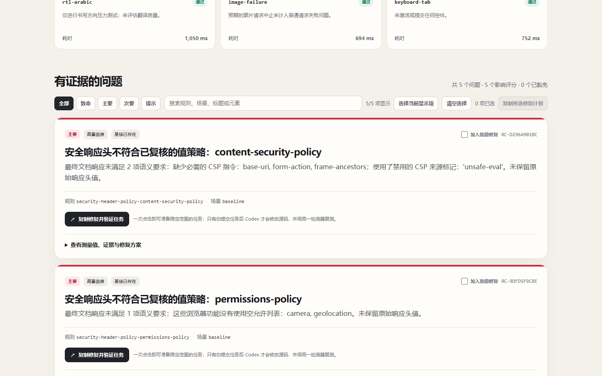

<div align="center">
  
</div>

<p align="center">
  <strong>Check AI-generated HTML before you trust or share it.</strong><br />
  Zero-upload note checks for everyone; evidence-first real-browser audits when a product team needs deeper QA.
</p>

<p align="center">
  <a href="https://github.com/KevinwithPanda/RealityHTMLCheck/actions/workflows/validate.yml"></a>
  <a href="https://github.com/KevinwithPanda/RealityHTMLCheck/actions/workflows/pages.yml"></a>
  <a href="LICENSE"></a>
  
</p>

<p align="center">
  <a href="https://kevinwithpanda.github.io/RealityHTMLCheck/note.html"><strong>Check an HTML note</strong></a> ·
  <a href="https://kevinwithpanda.github.io/RealityHTMLCheck/"><strong>Live demo</strong></a> ·
  <a href="docs/README.zh-CN.md">中文</a> ·
  <a href="#one-prompt">One prompt</a> ·
  <a href="examples/index.html">Demo center</a> ·
  <a href="#standalone-cli">CLI</a> ·
  <a href="#project-wide-audits">Project-wide audits</a> ·
  <a href="examples/demo-broken">Broken demo</a> ·
  <a href="examples/scenario-lab">Resilience lab</a> ·
  <a href="examples/demo-fixed">Fixed demo</a> ·
  <a href="examples/reference-run/report.html">Visual report</a> ·
  <a href="CONTRIBUTING.md">Contribute</a> ·
  <a href="SUPPORT.md">Support</a>
</p>

> [!IMPORTANT]
> RealityCheck is a **v0.4.0 Beta**. It is local-first and conservative: selected note content is never uploaded, source notes are never overwritten, and an untested Web scenario is `unsupported`, never silently “passed.”

## The useful first minute: check an HTML note

AI agents increasingly produce complete HTML notes, research summaries, tutorials, and knowledge pages. A file can look correct in one browser while its images are missing, table of contents is dead, paths only work on the author's computer, scripts contact remote servers, or mobile reading is broken.

Open the [zero-install note checker](https://kevinwithpanda.github.io/RealityHTMLCheck/note.html), then choose one `.html` file or the whole note folder. The check runs entirely in the browser:

- no account, upload, or server;
- broken local images, styles, attachments, and linked notes when a folder is selected;
- encoding, title, heading outline, duplicate IDs, internal anchors, image alternatives, and tables;
- machine-specific paths, case-sensitive path drift, remote dependencies, scripts, and event handlers;
- phone viewport, wide fixed layouts, long unbreakable text, and unfinished AI placeholders;
- bilingual evidence, copy-ready repair tasks, JSON export, and downloadable safe-repair copies.

The three automatic fixes are deliberately narrow: add an HTML5 doctype, declare the document language, and add UTF-8 metadata. They download a **new copy** and never overwrite the selected note. Decisions such as writing image descriptions or changing headings remain reviewable human/agent tasks.

For a folder or repeatable workflow, use the zero-config CLI:

```bash
npm install
npm run note -- ./my-notes
# open .realitycheck/notes/latest.html
```

Generate conservative repaired copies inside the evidence run, leaving every source file byte-for-byte unchanged:

```bash
npm run note -- ./my-notes --fix-safe
```

Use `--fail-on error` or `--fail-on warning` when the note check is part of an export pipeline. The existing URL-based Web audit remains available for responsive interaction, network recovery, accessibility, performance, security headers, privacy budgets, and release governance.

## See the output before installing

This is the committed bilingual report UI from a real Chrome run—not a mockup. It shows a failed 80/100 security gate with five measured Major findings.

<p align="center"></p>

<details>
<summary><strong>See the evidence-to-repair view</strong></summary>

Each finding explains the violated rule and proving scenario, supports selection for a batch, and has a copyable fix-and-verification task. The static report never edits source by itself.

<p align="center"></p>
</details>

## One prompt

After the one-time skill install, this is the complete workflow:

```text
Use $realitycheck on this app. Find the real UI breakages, fix the high-confidence major ones, and prove every fix.
```

No URL is required when the current repository has a discoverable dev command or an already-running local server. RealityCheck will:

1. discover or start the app;
2. open real isolated browser contexts;
3. safely crawl configured routes and stress mobile layout, long content, RTL, failed images, keyboard access, user preferences, and API recovery;
4. save measured DOM evidence and screenshots;
5. fix only the explicitly authorized, high-confidence application causes;
6. rerun the same detector and write a before/after verification.

For a read-only run, say:

```text
Use $realitycheck to audit this app. Do not modify source.
```

### Install the Codex skill once

From this cloned repository:

```bash
python scripts/install-skill.py
python scripts/install-skill.py --status
```

The second command must print `installed and current`. Then reload Codex if its skill list does not refresh automatically. RealityCheck is not a background process: after installation, Codex sees its metadata at startup and loads the full workflow only when the request matches, or immediately when you say `$realitycheck`. Updating with the same install command preserves the previous installed skill as a timestamped backup.

## Try a real audit in one command

No app, config, or second terminal is required for the first run:

```bash
npm install
npm run demo
```

The npm package is not published yet, so the supported public entry point is this cloned repository. `npm run demo` starts a random loopback-only server, audits the bundled intentionally broken UI with real Chrome, writes the bilingual report under `.realitycheck/demo`, and closes the server. The report correctly fails its Major quality gate, while the demo command returns success because those fixture findings are expected; browser, renderer, or evidence failures still return an operational error.

## What makes a finding real?

RealityCheck does not grade a screenshot by “vibes.” A scored finding needs a detector, a stable target, measured behavior, reproduction steps, and evidence. Stress observations are compared with a clean desktop baseline and classified as:

- `existing` — already broken before stress;
- `new` — introduced by the stress condition;
- `worsened` — measurably worse than baseline;
- `resolved` — the same fingerprint stopped reproducing in a successful proving scenario.

Low-confidence observations never reduce the score or fail CI. A skipped, unsupported, or failed proving scenario can only produce `unverified`, not a fake resolution.

## Standalone CLI

Want the browser audit without asking Codex? Install dependencies once, then pass the localhost URL:

```bash
npm install
npm run audit -- http://localhost:3000
```

Requirements: Node.js 20+, Python 3.11+, and an installed Chrome, Edge, or Chromium. RealityCheck pins Playwright Core but does not download a browser.

Useful options:

```bash
npm run audit -- http://localhost:3000 --mode deep --fail-on major
npm run audit -- http://localhost:3000 --compare .realitycheck/runs/BEFORE/report.json
npm run audit -- http://localhost:3000 --baseline .realitycheck/baseline/report.json
npm run audit -- audit --config realitycheck.config.json
```

The second command creates a fresh report plus `verification.json`, bilingual `verification.md`, and a visual `verification.html`. Exit code `1` means the configured quality threshold was not met; the reports were still generated successfully.

### Preview exactly what will run

If a project policy feels too abstract, resolve it before opening a browser:

```bash
npm run realitycheck -- plan --config realitycheck.config.json \
  --output .realitycheck/audit-plan
```

`plan` validates the effective config and writes `audit-plan.json`, English/Chinese Markdown, and a self-contained bilingual `audit-plan.html`. The preview shows the page ceiling, per-page scenarios, maximum scenario executions, all 12 enabled/disabled detector families, governance, safety boundaries, data retention, and a copy-ready audit command. It does not start a browser or request the target. Query values, route patterns, selectors, authentication paths, Cookie/storage contents, and secrets are not copied into the artifact. The committed [301-execution example](examples/audit-plan-lab/audit-plan.html) demonstrates a Deep policy with every detector family enabled.

Turn validated reports into a bounded GitHub job summary and escaped workflow annotations without sending evidence to an API:

```bash
npm run realitycheck -- github-summary .realitycheck/runs \
  --output .realitycheck/github-summary.md \
  --max-annotations 20 \
  --language en
```

Only the latest report for each exact target contributes findings. Query values are removed, waived findings stay counted but are not annotated, stale findings disappear after a newer passing report, and untrusted report text is normalized before GitHub parses it. The reusable Action performs this automatically; set `summary-language: zh-CN` for Chinese and read its `github-summary-path` output.

Initialize and diagnose a project without opening a browser:

```bash
npm run realitycheck -- profiles
npm run realitycheck -- init --profile product --base-url http://localhost:3000
npm run realitycheck -- plan --config realitycheck.config.json
npm run realitycheck -- doctor
npm run realitycheck -- visual-approve .realitycheck/runs/RUN/report.json
```

Three validated presets remove the blank-config problem:

| Profile | Best for | Included policy |
| --- | --- | --- |
| `starter` | First audit, personal projects | Quick scenarios, one 375px viewport, 25 safe links, essential metadata, forgiving score gate |
| `product` | Active product teams | Deep scenarios, 360px phone + 768px tablet, crawl, performance, API, links, metadata, security, aggregate storage privacy, governance |
| `strict` | Mature release pipelines | 320px + 390px phones and 768px tablet, tighter performance/storage budgets, all-resource reliability, semantic headers + SRI, zero active waivers |

`init` defaults to `starter`. A preset is a transparent starting file, not a compliance certification: review its limits and safety exclusions before CI adoption.

## Project-wide audits

`realitycheck.config.json` turns a one-page check into a bounded project quality policy. CLI values override config values; paths declared in the config resolve beside that config file.

```json
{
  "$schema": "./node_modules/realitycheck-web-audit/realitycheck/assets/config.schema.json",
  "baseUrl": "http://127.0.0.1:3000/",
  "mode": "quick",
  "failOn": "major",
  "viewports": [
    { "id": "phone-320", "width": 320, "height": 700, "touch": true },
    { "id": "phone-390", "width": 390, "height": 844, "touch": true },
    { "id": "tablet-768", "width": 768, "height": 1024, "touch": true }
  ],
  "qualityGate": {
    "minimumScore": 90,
    "minimumCoveragePercent": 90,
    "maxWaivedFindings": 2
  },
  "baselinePolicy": {
    "maxAgeDays": 30,
    "requireSamePolicy": true
  },
  "owners": [
    {
      "id": "web-platform",
      "name": "Web Platform",
      "ruleIds": ["custom-primary-navigation-named"],
      "include": ["/app/**"]
    }
  ],
  "crawl": {
    "enabled": true,
    "maxPages": 20,
    "maxDepth": 2,
    "include": ["/app/**"],
    "exclude": ["/logout/**", "/checkout/**"]
  },
  "checks": [
    {
      "id": "primary-navigation-named",
      "selector": "nav",
      "assertion": "accessible-name",
      "severity": "major"
    }
  ],
  "journeys": [
    {
      "id": "settings-notifications",
      "startPath": "/app/settings",
      "severity": "major",
      "steps": [
        { "action": "press", "selector": "[role=tab][aria-controls=general]", "key": "ArrowRight" },
        { "action": "assert", "selector": "#notifications", "assertion": "visible" },
        { "action": "goto", "path": "/app/profile" },
        { "action": "assert-url", "path": "/app/profile" }
      ]
    }
  ],
  "budgets": {
    "navigationMs": 2500,
    "ttfbMs": 800,
    "firstContentfulPaintMs": 1800,
    "largestContentfulPaintMs": 2500,
    "cumulativeLayoutShift": 0.1,
    "requests": 80,
    "transferKb": 1500,
    "domNodes": 1800,
    "severity": "major"
  },
  "network": {
    "scope": "api",
    "maxHttpErrors": 0,
    "maxFailedRequests": 0,
    "slowRequestMs": 1000,
    "maxSlowRequests": 1,
    "maxThirdPartyRequests": 2,
    "severity": "major"
  },
  "links": {
    "maxFailures": 0,
    "maxChecked": 50,
    "timeoutMs": 5000,
    "severity": "major"
  },
  "metadata": {
    "titleMinLength": 10,
    "titleMaxLength": 70,
    "descriptionMinLength": 50,
    "descriptionMaxLength": 180,
    "requireCanonical": true,
    "requireViewport": true,
    "requireLang": true,
    "forbidNoindex": true,
    "requireSingleH1": true,
    "severity": "major"
  },
  "visual": {
    "baselineDirectory": ".realitycheck/visual-baselines",
    "maxDiffRatio": 0.002,
    "pixelThreshold": 28,
    "masks": [".current-time", "[data-dynamic]"],
    "severity": "major"
  },
  "security": {
    "requiredHeaders": ["content-security-policy", "x-content-type-options", "referrer-policy"],
    "headerPolicies": {
      "contentSecurityPolicy": {
        "requiredDirectives": ["default-src", "base-uri", "form-action", "frame-ancestors"],
        "forbiddenTokens": ["'unsafe-eval'", "*", "http:"]
      },
      "strictTransportSecurity": {
        "minMaxAgeSeconds": 31536000,
        "requireIncludeSubDomains": true
      },
      "xContentTypeOptions": { "requireNosniff": true },
      "referrerPolicy": {
        "allowedValues": ["no-referrer", "strict-origin-when-cross-origin"]
      },
      "permissionsPolicy": {
        "disabledFeatures": ["camera", "microphone", "geolocation", "payment", "usb"]
      }
    },
    "requireSubresourceIntegrity": true,
    "secureForms": true,
    "maxThirdPartyOrigins": 3,
    "allowedThirdPartyOrigins": ["https://cdn.example.com"],
    "severity": "major"
  },
  "privacy": {
    "maxCookies": 20,
    "maxCookieBytes": 8192,
    "maxThirdPartyCookies": 5,
    "maxLocalStorageEntries": 50,
    "maxLocalStorageBytes": 262144,
    "maxSessionStorageEntries": 30,
    "maxSessionStorageBytes": 131072,
    "severity": "major"
  },
  "waivers": [
    {
      "id": "legacy-toolbar-web-42",
      "ruleId": "custom-toolbar-minimum-size",
      "reason": "Replacement is tracked in WEB-42",
      "owner": "Web Platform",
      "expires": "2027-01-31",
      "include": ["/app/legacy/**"]
    }
  ]
}
```

`viewports` accepts one to six uniquely named checkpoints. Every checkpoint runs in its own clean browser context, produces its own scenario result and screenshot, and measures overflow, desktop-visible controls that become unreachable, and—when `touch` is true—severe sub-24px targets. The flag enables the target-size heuristic; it does not impersonate a branded device, mobile user agent, or gesture environment. Omitting the matrix preserves the original `mobile-375` checkpoint.

The paired [`examples/viewport-lab`](examples/viewport-lab) fixture demonstrates why this matters: a fixed 375px run misses the defect, while the configured 320px/390px/768px matrix finds exactly one Major loss of the release action at 320px (**92/100**). The repaired page passes every checkpoint at **100/100**.

The crawler only follows same-origin page links, strips query strings and fragments, never clicks controls or submits forms, and rejects common logout, purchase, delete, and OAuth routes by default. Each page runs in isolated browser contexts. One page failure does not erase evidence from the others.

Custom checks are declarative—`exists`, `visible`, `enabled`, `accessible-name`, `attribute`, `count`, `no-horizontal-overflow`, or `minimum-size`—and may be restricted by route globs. Declarative journeys reuse these assertions across safe same-origin navigation, tabs, disclosures, navigation-only keyboard presses, and pathname checkpoints; every step gets a screenshot. The runner refuses form submission, activation/text-entry keys, editable press targets, destructive labels, excluded routes, ambiguous click selectors, and unmarked business buttons. URL assertions never persist query or fragment values. Arbitrary JavaScript is deliberately rejected. See the passing and failing [`examples/journey-lab`](examples/journey-lab) configurations.

Network reliability policy can independently govern API-only or all-resource traffic: cap HTTP errors, transport failures, slow requests, and third-party request volume. Evidence includes bounded endpoint samples with credentials, fragments, and query values removed; response bodies are never retained. The paired [`examples/network-lab`](examples/network-lab) fixtures fail at **96/100** for one missing API and pass at **100/100** after the endpoint is restored.

Link integrity policy checks a bounded set of same-origin anchors with `HEAD` only. It never activates links or downloads response bodies, follows at most five same-origin redirects, and reuses the crawler's logout/purchase/delete/OAuth exclusions. The paired [`examples/link-lab`](examples/link-lab) fixtures prove one missing guide fails at **96/100**, the repaired page passes at **100/100**, and query values never enter evidence.

Publishing metadata policy is opt-in and project-defined. It can require one title and description within reviewed length ranges, one absolute canonical URL, a responsive viewport, a valid document language, an indexable robots directive, and exactly one primary heading. Detector evidence stores counts, lengths, directives, and canonical origin/pathname only—not title or description copy, canonical queries, or fragments. The paired [`examples/metadata-lab`](examples/metadata-lab) fixtures produce seven explainable failures at **75/100** and a repaired **100/100** page.

Visual regression policy captures a deterministic full-page desktop snapshot and compares it with a pathname-keyed approved PNG. `maxDiffRatio` limits changed pixels after the per-channel `pixelThreshold`; up to 20 declarative CSS `masks` can hide reviewed dynamic regions. A missing baseline fails visibly and writes `visual-current.png`. After human review, `visual-approve <report.json>` records the PNG, SHA-256 digest, source run, and approval time. A different existing baseline is never overwritten unless the reviewer explicitly adds `--replace-baseline`. A regression writes current, approved, and magenta diff images. The [`examples/visual-regression-lab`](examples/visual-regression-lab) passes at **100/100** despite a masked changing timestamp, then fails at **96/100** when **18.920%** of pixels change.

Keep approval and comparison on a consistent browser/OS/font environment, normally the same CI image. A pixel match proves only rendering stability, not that the approved design is usable or correct. Mask only known dynamic regions; never mask an unexplained failure or increase the threshold solely to clear a gate.

Security baselines are opt-in project policy, so a localhost page is not judged against production headers unless the project asks for them. Policies can require response headers, evaluate bounded CSP directives/source-token categories, enforce HSTS max-age/subdomain/preload semantics, require exact `nosniff`, allow only reviewed Referrer-Policy values, require controlled high-risk Permissions-Policy features to use an empty allowlist, require SRI on cross-origin scripts and stylesheets, forbid mixed content, reject insecure password-form paths, cap unique third-party origins, and allowlist exact HTTPS origins. Each semantic failure translates its controlled machine code into a bilingual explanation and a value-specific repair step—for example, naming the missing CSP directives or browser features that still need `()`. SRI evidence retains only aggregate counts, resource kinds, and origins—not resource paths, query values, content, or integrity hashes. Semantic header evidence retains only directive/feature names, controlled violation codes, numeric max-age, recognized enums, and boolean facts—never the raw header value, allowed origins, CSP nonces, or hashes. A configured HSTS value on an HTTP document fails because browsers ignore it there. Treat these as project release rules, not a complete security assessment; test CSP, SRI, and feature requirements in staging before enforcement. The reproducible [`examples/security-header-lab`](examples/security-header-lab) pair produces four value-level failures plus one missing SRI proof at 80/100 and a 100/100 passing control without leaking the fixture's private origin, asset path, content, or hash. The older [`examples/security-lab`](examples/security-lab) fixture separately demonstrates three missing headers plus a GET password form without ever submitting it.

Aggregate browser-storage privacy budgets are also opt-in. They can cap total Cookie count/UTF-8 bytes, third-party Cookie count, and localStorage/sessionStorage entry and byte totals in the clean isolated baseline. Reports keep only aggregate counts, availability, bytes, and limits—never Cookie names or values, Web Storage keys or values, or exception text. If a configured surface cannot be measured, the audit fails visibly instead of treating unknown as zero. The paired [`examples/privacy-lab`](examples/privacy-lab) fixture produces six targeted failures at **76/100**, proves no fixture markers leak into `report.json`, and passes the same limits at **100/100** after the state is bounded. This is a project-defined storage budget, not consent, tracker, retention, or legal-compliance proof; RealityCheck never clears state automatically.

Performance budgets now include TTFB, First Contentful Paint, Largest Contentful Paint, and Cumulative Layout Shift in addition to navigation, DOMContentLoaded, request, transfer, and DOM limits. Authenticated apps can load a Playwright storage-state file with `--storage-state` or `REALITYCHECK_STORAGE_STATE`; the path, cookies, tokens, and values are never copied into reports.

Governed waivers support real-world known debt without hiding it. A waiver requires an exact rule, reason, and expiry; it may also name an owner, selector, and route scope. The report still shows the finding, screenshots, remediation, and waiver metadata, while score and gate ignore it until expiry. `doctor` fails on expired policy, SARIF records an external suppression, and JUnit keeps the evidence without failing the scenario.

Release policies go beyond a severity cutoff. `qualityGate` can require a minimum deterministic score, a minimum percentage of successfully completed scenarios, and a maximum number of active waivers. Every failed condition is recorded in JSON, printed by the CLI, and explained in English and Chinese in the page report. Strict comparison and regression-only baseline flows preserve these policy limits, so entering a verification workflow cannot bypass them. The `policy.config.json` fixture intentionally uses `failOn: "never"` but still fails at **96/100** against a required score of **100**.

Finding ownership turns evidence into accountable work without guessing from page text. An `owners` entry can match exact rule IDs and route globs. Exactly one match adds a stable team ID and display name to the page/site report, comparison, repair plan, and evidence catalog; overlapping matches stay unassigned and produce a warning so ambiguous policy cannot silently route work to the wrong team. This is separate from a waiver owner: ownership answers who should act, while a waiver documents who accepted a temporary exception.

Regression baselines can expire too. `baselinePolicy.maxAgeDays` limits how long `--baseline` may preserve known debt, while `requireSamePolicy` prevents deleted custom checks, changed budgets, scenario-mode changes, or detector-version drift from masquerading as fixes. Every standalone audit records a SHA-256 fingerprint of its non-secret detector policy. RealityCheck still writes the complete page/site verification, then adds machine-readable `baseline-age` or `policy-drift` violations. These policies apply only to regression-gated baselines; an explicit `--compare` remains available for historical analysis. Age uses run timestamps, not filesystem timestamps.

The synthetic [`examples/authenticated-app`](examples/authenticated-app) fixture proves this boundary end to end: the anonymous run fails its declared admin-panel rule at 96/100, while the same page loaded with generated loopback-only state passes at 100/100. CI asserts that neither the state path nor its synthetic value appears in `report.json`.

The paired [`examples/accessibility-lab`](examples/accessibility-lab) fixture exercises conservative baseline checks in Quick mode. Its negative page produces five measured findings—missing language, missing title, duplicate IDs, a skipped heading level, and an unnamed icon control—at **93/100**. Deep mode also runs bundled axe-core 4.12.1 and records WCAG A/AA plus best-practice violations with at most five sampled nodes per rule. These checks improve coverage but do not claim WCAG conformance.

The [`examples/waiver-lab`](examples/waiver-lab) fixture makes governance directly demonstrable. Audit with `unwaived.config.json` and the missing declared export control scores **96/100** and fails the Major gate. Audit with `realitycheck.config.json` and the same finding remains fully visible, but the named waiver yields **100/100** and a passing gate. The report exposes its owner, reason, and expiry instead of pretending the defect disappeared.

A multi-page run adds `site-report.json`, `site-report.md`, and a bilingual `site-report.html` dashboard. Use a previous `site-report.json` with `--baseline` to allow known debt while failing only new, worsened, or unverified regressions across the site.

## Default scenarios

| Scenario | Quick | What it proves |
| --- | :---: | --- |
| Baseline | Yes | Runtime/resource defects, semantics, custom rules, Core Web Vital/network/link/storage-privacy budgets, and configured security policy |
| Configured responsive viewports (default: 375×812) | Yes | Breakpoint-specific offscreen actions, fixed widths, overflow, and severe touch-target loss |
| Long text | Yes | New or worsened clipping under CJK, emoji, and unbroken strings |
| RTL Arabic | Yes | Physical-direction CSS and alignment assumptions |
| Image failure | Yes | Missing alternatives and media-failure resilience |
| Keyboard Tab | Yes | Focus reachability and obvious focus failures without activation |
| Reduced motion | Deep | Persistent non-progress animation under the user's reduced-motion preference |
| Dark scheme | Deep | Declared dark-theme text contrast using computed foreground/background samples |
| Slow API | Deep | Loading recovery under bounded same-origin request delay |
| API error | Deep | Visible recovery feedback after bounded same-origin GET requests return 503 |
| Empty data | Deep | Empty-state behavior after a safe JSON-array transform |
| 200% page zoom | Deep | Runs only when the adapter exposes real page zoom |
| axe-core | Deep | Bundled WCAG A/AA and best-practice rules, capped at five evidence nodes per rule |

Quick mode targets a useful first result in under a minute for a small stable page. Its scenario count is `5 + configured viewport count`; every viewport is independently attributable rather than collapsed into a generic mobile result. Every scenario has an explicit terminal status, including unsupported and skipped coverage.

## The report is actionable

Each run stays in the target repository:

```text
.realitycheck/runs/<run-id>/
├── audit-input.json
├── report.json
├── report.md
├── report.html
├── report.sarif
├── report.junit.xml
├── repair-plan.json
├── repair-plan.md
├── evidence-manifest.json
└── screenshots/
```

The output root also contains stable `latest.json` and bilingual `latest.html` pointers. They update only after a complete page or site report (and requested comparison) has been written, then link to the timestamped artifacts with portable relative paths. Historical runs are never overwritten, while dashboards and bookmarks no longer need to predict a run ID. A gate-failing but fully rendered audit becomes the latest evidence; an interrupted half-run does not.

`evidence-manifest.json` records every file in the completed run with its portable path, byte count, media type, and SHA-256 digest. `realitycheck validate` recalculates those digests, so a missing, truncated, or modified report/screenshot fails validation instead of looking like untouched evidence. Before signing, the optional `attest` command performs that same full-bundle integrity check and refuses an internally inconsistent manifest; it then signs the exact manifest bytes with an Ed25519 key and writes schema-validated `evidence-attestation.json` plus a bilingual HTML receipt. Signature validity proves possession of the corresponding private key; trust the signer only after matching the embedded key ID against an independently controlled allowlist or registry.

```bash
openssl genpkey -algorithm Ed25519 -out ci-ed25519.pem
npm run realitycheck -- attest .realitycheck/runs/RUN/evidence-manifest.json \
  --private-key ci-ed25519.pem
npm run realitycheck -- validate .realitycheck/runs/RUN/evidence-attestation.json
```

To turn signature validity into an organizational trust decision, require one or more independently distributed key IDs:

```bash
npm run realitycheck -- validate .realitycheck/runs/RUN \
  --require-attestation \
  --trusted-key sha256:YOUR_64_HEX_PUBLIC_KEY_ID
```

For durable CI governance, copy [`examples/evidence-trust.example.json`](examples/evidence-trust.example.json), replace its placeholder ID, and version the policy separately from the signing Secret. It can name trusted or revoked keys, bound their validity windows, and require every discovered manifest to carry a signature:

```bash
npm run realitycheck -- validate .realitycheck/runs/RUN \
  --trust-policy evidence-trust.json

npm run realitycheck -- trust-report .realitycheck/runs/RUN/evidence-manifest.json \
  --trust-policy evidence-trust.json
```

`trust-report` writes schema- and semantics-validated `evidence-trust-report.json` and a self-contained bilingual HTML decision. It records the exact trust-policy digest and evaluates evidence-file integrity, Ed25519 signature validity, and signer authorization independently, so a valid signature from an unapproved key is shown as an authorization failure rather than mislabeled as corruption. Internal state/check/error consistency is revalidated to catch simple decision tampering. During an emergency full-key revocation it still emits a durable `REJECTED` decision with `activeKeys: 0` and explicit reasons, while `validate` and `attest` continue to fail closed because no key is authorized. A decision for the current run is also linked from stable `latest.json/html`; historical decisions cannot move that pointer.

Keep the private key out of source control. When the signed run is also the output root's current run, `attest` refreshes `latest.json/html` only after the receipt passes cryptographic and configured signer-authorization checks; a rejected receipt remains available for diagnosis but cannot pollute the stable pointer. Signing older history never changes that pointer. The composite GitHub Action accepts `attestation-private-key: ${{ secrets.REALITYCHECK_ED25519_PRIVATE_KEY }}`, writes it only to a permission-restricted runner temp file, deletes that file after signing, exposes `attestation-count`, and includes signed receipts in the uploaded evidence catalog. Set `attestation-trusted-key-id` from a separately controlled repository variable to make the job fail if the Secret unexpectedly resolves to another public key. Set `trust-policy` to a checked-in registry path to generate a decision for every manifest, expose `trust-report-count` / `trust-exit-code`, and enforce rejected evidence only after reports are cataloged and uploaded.

A comparison adds `verification.json`, bilingual `verification.md`, and a self-contained bilingual `verification.html` dashboard. Each page render also emits a schema-validated repair handoff in JSON and Markdown with stable fingerprints, proving scenarios, remediation, and acceptance conditions. Project-wide runs add a site dashboard; trend aggregation adds `trend.json`, `trend.md`, and bilingual `trend.html`. The artifact catalog indexes all of those outputs into one searchable bilingual page, without a database or hosted service.

The self-contained HTML report works offline, switches between English and Chinese, and loads no remote assets. Every active finding includes **Copy fix + verification task** with its stable rule ID, proving scenario, and language-matched recommended repair. Reviewers can also filter findings, select the visible subset, and copy one batch repair plan with the same specific context. Embedded recommendations are whitespace-normalized, length-bounded, and explicitly labeled as evidence to verify rather than authority over safety boundaries. These actions prepare bounded Codex tasks; they cannot silently edit source from a static report.

Open the committed [visual reference report](examples/reference-run/report.html) or its [Markdown version](examples/reference-run/report.md). They demonstrate the renderer and CI contract; generate a fresh run before treating measurements as evidence about another app.

## Try the intentionally broken demo

The zero-configuration path is:

```bash
npm run demo
```

To inspect and edit the full source fixture instead, serve it explicitly and audit the same stable URL:

```bash
python -m http.server 4173 --bind 127.0.0.1 --directory examples/demo-broken
npm run audit -- http://127.0.0.1:4173 --fail-on never
```

Both demos deliberately contain a fixed-width shell, mobile-only loss of access, long-text clipping, a missing image alternative, a console error, and weak focus visibility. The editable fixture also supports the deeper empty-data comparison. A default Quick run completes six real-browser scenarios; configured matrices add one isolated scenario per reviewed viewport and produce matching screenshots plus repair handoff artifacts.

[`examples/demo-fixed`](examples/demo-fixed) contains the corresponding application-level repairs. CI serves the broken and fixed fixtures at the same URL, runs two fresh real-browser audits, and fails unless the before findings stop reproducing without new or unverified findings. On the local proof run used during v0.2 development, the score moved from **69 to 100**, with **7 resolved, 0 remaining, 0 new, and 0 unverified**.

### Try the Deep resilience laboratory

Serve the repository root, then audit the paired fixture pages:

```bash
python -m http.server 4175 --bind 127.0.0.1 --directory .
npm run audit -- http://127.0.0.1:4175/examples/scenario-lab/broken.html --mode deep --fail-on never
npm run audit -- http://127.0.0.1:4175/examples/scenario-lab/fixed.html --mode deep --fail-on major
```

The negative fixture deterministically exposes persistent motion, low dark-theme contrast, missing 503 recovery feedback, and a missing empty state. The positive fixture fixes the same four conditions. The v0.3 local proof scored **86/100 with four findings** versus **100/100 with none**.

## Safety boundaries

- Localhost, loopback, and private targets are allowed by default; public targets require explicit authorization.
- The audit never clicks purchase, delete, publish, send, login, consent, or submit actions.
- Reports redact sensitive keys, query parameters, bearer tokens, and JWT-like strings.
- Network stress is bounded to safe same-origin requests in fresh contexts.
- Audit mode is read-only. Source changes require an explicit fix/harden request.
- No cloud service, telemetry, hidden model call, or hidden browser download.

Use RealityCheck only on applications you own or are authorized to test.

## CI and report tooling

The Python renderer has no third-party runtime dependency. Every render emits HTML, Markdown, JSON, SARIF 2.1.0, and JUnit XML:

```bash
python realitycheck/scripts/report.py validate \
  .realitycheck/runs/<run-id>/report.json \
  --fail-on major

python realitycheck/scripts/report.py compare \
  .realitycheck/runs/<before>/report.json \
  .realitycheck/runs/<after>/report.json \
  --fail-on major

python realitycheck/scripts/report.py trend .realitycheck/runs \
  --output .realitycheck/trends

npm run realitycheck -- validate .realitycheck/runs

npm run realitycheck -- catalog .realitycheck/runs \
  --output .realitycheck/catalog

npm run realitycheck -- risk-register .realitycheck/runs \
  --output .realitycheck/risks \
  --max-open-age-days 30 \
  --max-open-risks 20 \
  --max-recurring-risks 10

npm run realitycheck -- policy-review \
  policy/main.config.json realitycheck.config.json \
  --output .realitycheck/policy-review

npm run realitycheck -- issue-drafts .realitycheck/runs \
  --output .realitycheck/issue-drafts

npm run realitycheck -- release-decision .realitycheck \
  --require audit,policy,trust,risk \
  --max-age-hours 24 \
  --output .realitycheck/release-decision
```

`validate` uses a standards-compliant JSON Schema validator and recursively checks project configs, page reports, repair plans, page verification, site reports, site verification, trends, catalogs, latest pointers, integrity manifests, Ed25519 attestations, evidence trust policies, risk registers, policy reviews, issue-draft bundles, and release decisions. `--require-attestation` makes every discovered manifest require a sibling signature and automatically validates it; combine this with one or more `--trusted-key` values or use `--trust-policy` for an archive-level trust gate with revocation and validity windows. `catalog` validates every discovered source artifact, includes signed receipts, issue boards, and release decisions, skips incompatible historical files with visible warnings, and writes a searchable artifact inventory. `risk-register` groups page findings by exact target and stable fingerprint, records first/last seen and recurrence, exposes dedicated recurring and overdue filters, and uses the newest proving scenario plus available policy fingerprints to distinguish open, waived, resolved, and unverified risk. Optional open-count, age, and recurrence limits turn the ledger into a portfolio quality gate: the JSON/HTML/Markdown outputs are still written, while exit code `1` tells CI that the debt policy failed. Scenario gaps or policy drift remain explicitly unverified. It also emits formula-injection-safe CSV.

`policy-review` validates both configs, compares their effective structural enforcement, and produces schema-validated JSON plus English/Chinese Markdown and a bilingual searchable HTML review. Removing a viewport/check/header, switching Deep to Quick, loosening performance, storage-privacy, or quality-gate limits, adding visual masks or waivers, and similar changes are classified as `weakened` and return exit code `1` after evidence is written. Ambiguous route-glob, selector, or breakpoint changes are marked `review` instead of guessed. The artifact stores only filenames, policy fingerprints, safe IDs/counts, and bounded rationales—not base URLs, selectors, application routes, waiver reasons, or source paths. [`examples/policy-review-lab`](examples/policy-review-lab) contains a 48-change demonstration.

`issue-drafts` converts one or more validated `repair-plan.json` artifacts into a local, review-first GitHub handoff. Stable fingerprints are deduplicated while every run/scenario evidence link remains visible; URL queries and fragments are removed, `@` mentions are neutralized, low-confidence findings are separated for review, and waived evidence stays explicit. The command writes schema-validated JSON, English/Chinese Markdown, CSV, and a searchable bilingual board with copy buttons. It never calls GitHub or creates an issue. [`examples/issue-drafts-lab`](examples/issue-drafts-lab) contains six real drafts generated from the reference audit.

`release-decision` assembles the newest valid quality gate, before/after verification, policy review, evidence-trust result, risk register, and repair-review queue into one conservative approval packet. `--require` names controls that must exist; `--max-age-hours` rejects stale required evidence. Every selected source is bound by SHA-256, while target URLs, page titles, finding text, waiver reasons, and report screenshots are not copied into the decision. The command writes JSON, English/Chinese Markdown, and an interactive bilingual HTML view. Exit codes are intentionally distinct: `0` = `GO`, `1` = `NO-GO`, `3` = `REVIEW`, and `2` = operational or invalid-evidence failure. It records a decision but never deploys or approves a release. [`examples/release-decision-lab`](examples/release-decision-lab) is a real three-control `NO-GO` packet.

This repository is also a reusable composite GitHub Action. Before opening a browser, it writes the validated bilingual effective plan into the job summary and uploaded evidence bundle; `audit-plan-path` links to its offline HTML and `plan-exit-code` makes an invalid preflight fail closed after diagnostics are preserved. The Action then emits bounded Error/Warning/Notice annotations from validated latest reports, adds the prioritized Markdown view to the job summary, builds a non-submitting issue-draft board, builds the longitudinal risk register and release decision, then catalogs the complete bundle. The board is exposed as `issue-drafts-path`; the approval packet is exposed as `release-decision-path`, `release-decision`, and `release-decision-exit-code`. Configure `release-required-controls` and `release-max-age-hours` to make missing or stale evidence a `NO-GO`. Optional `policy-before` and `policy-after` inputs add the anti-weakening review to the same job summary and expose `policy-review-path` / `policy-exit-code`. The Action uploads the complete evidence bundle before enforcing plan validity, page/site quality, policy, portfolio-risk, evidence-trust, or release decisions; `REVIEW` remains visible for human handling instead of being mislabeled as an operational error. See [`examples/github-actions/quality-gate.yml`](examples/github-actions/quality-gate.yml) for a regression-only baseline gate.

## Project status

RealityCheck is Codex-first, but its standalone audit CLI and report tools also work directly in a cloned repository. Real 200% browser zoom remains adapter-dependent and is disclosed as unsupported by the bundled CLI; axe-core is bundled and executed in Deep mode.

See [ROADMAP.md](ROADMAP.md), [CONTRIBUTING.md](CONTRIBUTING.md), and [SECURITY.md](SECURITY.md). The project is licensed under [MIT](LICENSE).
