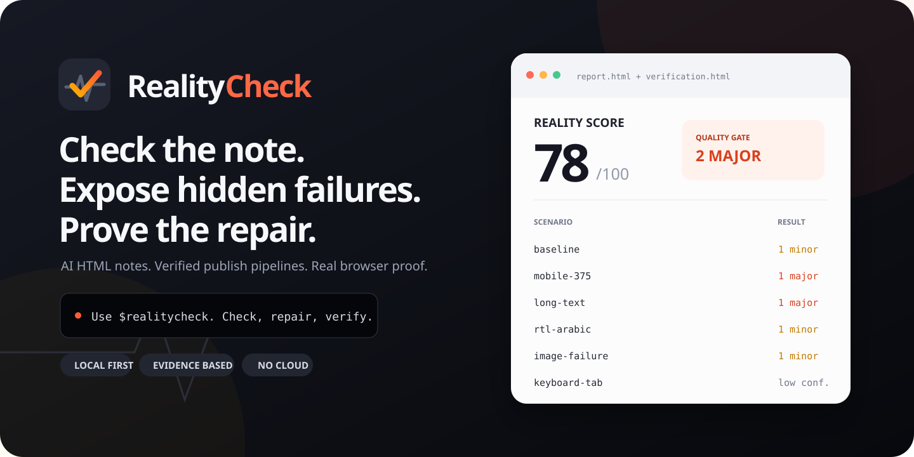
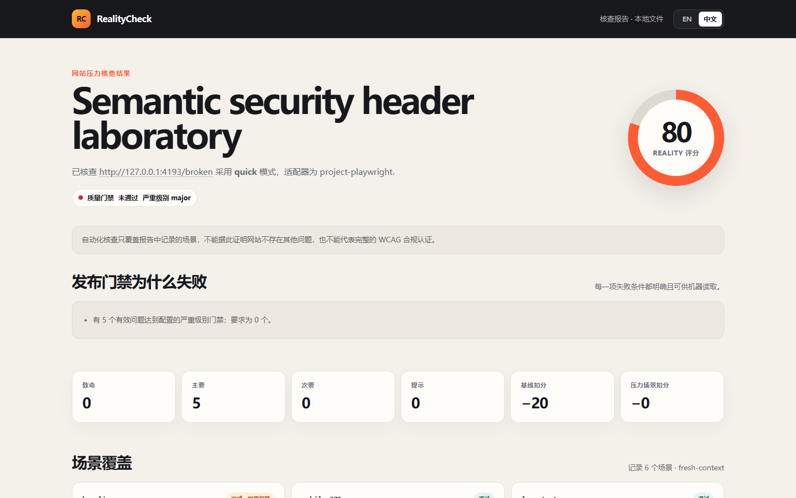

<div align="center">
  
</div>

<div align="center">

# RealityCheck

**AI can generate HTML in seconds. RealityCheck finds what “it opens on my machine” misses.**

Check whether an HTML note is truly portable, and whether a Web UI survives real browser conditions.

[中文文档](docs/README.zh-CN.md) · [Try the HTML note checker](https://kevinwithpanda.github.io/RealityHTMLCheck/note.html) · [Open a real report](https://kevinwithpanda.github.io/RealityHTMLCheck/reference/report.html) · [Run the demo](https://kevinwithpanda.github.io/RealityHTMLCheck/)

[](https://github.com/KevinwithPanda/RealityHTMLCheck/actions/workflows/validate.yml)
[](https://github.com/KevinwithPanda/RealityHTMLCheck/actions/workflows/pages.yml)
[](LICENSE)


</div>

> **Opens locally ≠ portable. Compiles ≠ works for users.**

RealityCheck is a local-first checker, Codex Skill, and evidence-first Web audit tool for the gap between valid HTML and usable HTML.

## Two problems worth solving

### 1. HTML notes that look finished but are not shareable

AI agents and export tools increasingly produce research notes, tutorials, reports, and knowledge pages as `.html`. A browser may open the file successfully while important failures remain hidden:

- images, styles, attachments, or linked notes exist only on the author's computer;
- Windows paths fail on macOS/Linux, or filename case changes break after deployment;
- a table of contents points to missing or duplicate anchors;
- Chinese, emoji, or symbols reopen with damaged encoding;
- scripts and remote dependencies make a supposedly local note execute code or contact a server;
- fixed-width layouts, long strings, missing viewport metadata, or weak structure make the note hard to read and reuse.

RealityCheck checks the **whole note folder**, not just one HTML string. Its 30 deterministic rules cover integrity, structure, navigation, attachments, portability, readability, accessibility markup, unsafe behavior, and unfinished AI placeholders.

### 2. Cross-platform Web failures hidden by the happy path

A compiler can confirm syntax. A unit test can confirm a function. Neither proves that a page still works on a 320 px screen, with long content, RTL text, a missing image, keyboard navigation, zoom, an empty API response, or a slow/failed request.

RealityCheck's Web mode opens real isolated browser contexts and records what changes under controlled scenarios:

- phone/tablet viewports, horizontal overflow, touch-target sizing, and fixed layouts;
- long text, RTL, 200% zoom, keyboard access, reduced motion, and declared dark scheme;
- broken images, empty data, slow APIs, simulated 503 recovery, console and network failures;
- accessibility checks, performance budgets, link integrity, publishing metadata, security headers, and aggregate browser-storage privacy budgets;
- multi-page safe crawl, declarative journeys, visual baselines, policy gates, and before/after verification.

Unsupported or skipped coverage stays visible. It is never converted into a fake pass.

## Why this is not another HTML linter

| | Compiler / linter | General AI review | RealityCheck |
| --- | --- | --- | --- |
| Syntax and markup hints | Yes | Usually | Yes |
| Verify local images, attachments, linked notes, and path case | Rarely | Only if every file is supplied and inspected | **Folder-aware** |
| Reproduce responsive, content, keyboard, and network conditions | No | Usually simulated in text | **Real browser scenarios** |
| Keep measured evidence and stable finding IDs | No | Inconsistent | **HTML + JSON + screenshots** |
| Repair inside Codex and rerun the same check | No | Possible, but ad hoc | **Defined Skill workflow** |
| Prove a finding stopped reproducing without hiding known debt | No | Rarely | **Before/after verification** |

The innovation is the closed loop:

```text
inspect the real artifact → expose hidden failure → explain the evidence
→ repair a separate copy → rerun the same detector → deliver proof
```

It complements compilers and AI models rather than competing with them. The model supplies judgment where judgment is necessary; deterministic checks and browser evidence prevent confident guesses from becoming the quality gate.

## Use it as software or as a Codex Skill

| Experience | Best for | What happens |
| --- | --- | --- |
| [Online note checker](https://kevinwithpanda.github.io/RealityHTMLCheck/note.html) | Anyone with an HTML file/folder | Zero install, zero upload, static local inspection in the browser |
| CLI | Repeatable exports and CI | Bilingual reports, JSON evidence, repair plans, thresholds |
| `$realitycheck` Skill | End-to-end work in Codex | Inspect, create a working copy, repair high-confidence issues, recheck, and return the usable output plus both reports |

### The end-to-end Skill workflow

Install the Skill once from a clone of this repository:

```bash
python scripts/install-skill.py
python scripts/install-skill.py --status
```

Reload Codex if necessary, then ask once:

```text
Use $realitycheck to check and repair this HTML note folder.
Do not overwrite the originals. Return the technical report,
the repaired usable HTML folder, the after report, and anything
that could not be fixed without inventing content.
```

That one request authorizes edits to a **new working copy**. The Skill first copies the bounded note bundle with its local images, styles, attachments, and linked notes into the evidence run, applies the three safe metadata repairs, lets Codex repair justified findings directly, reruns the same note check, and returns:

1. the before technical report;
2. the repaired HTML file or self-contained folder;
3. the after technical report;
4. a concise change list and unresolved decisions.

There is no need to copy a prompt from the report back into the same Codex task. Missing source material, factual descriptions, citations, or ambiguous interactive behavior are not fabricated to create a perfect score.

For a Web project:

```text
Use $realitycheck on this app. Find the real UI breakages,
fix the high-confidence major ones, and prove every fix.
```

For inspection only:

```text
Use $realitycheck to audit this app. Do not modify source.
```

## Try it in one minute

### No-install HTML note check

Open the [online checker](https://kevinwithpanda.github.io/RealityHTMLCheck/note.html), select one `.html` file or the entire note folder, and inspect the result locally. The selected content is not uploaded and note scripts are not executed.

The **Download safe repaired copy** button is deliberately narrow. It creates a new file and can only:

1. add an HTML5 doctype;
2. infer and declare `lang="zh-CN"` or `lang="en"`;
3. add an early UTF-8 charset declaration.

It is **not** an “all problems fixed” download. Headings, image descriptions, missing files, paths, scripts, and content decisions require review. Use the Skill workflow when you want Codex to carry those repairs through to a verified copy.

### Local note CLI

```bash
git clone --depth 1 https://github.com/KevinwithPanda/RealityHTMLCheck.git
cd RealityHTMLCheck
npm install
npm run note -- ./my-notes
```

Open `.realitycheck/notes/latest.html`. To generate only the three conservative metadata repairs without touching the originals:

```bash
npm run note -- ./my-notes --fix-safe
```

Use `--fail-on error` or `--fail-on warning` in an export pipeline.

### Real-browser Web audit

With an authorized local app already running:

```bash
npm run audit -- http://localhost:3000
```

For the self-contained intentionally broken demo:

```bash
npm run demo
```

Requirements: Node.js 20+, Python 3.11+, and an installed Chrome, Edge, or Chromium. RealityCheck uses Playwright Core but does not silently download a browser.

## Reports made for decisions, not decoration

Every active finding leads with the rule, severity, evidence, reproduction path, recommended repair, and proving scenario. Reports are self-contained, work offline, and switch between English and Chinese.

<p align="center">
  
</p>

Outputs can include:

- `report.html` — visual bilingual report;
- `report.json` and `report.md` — machine-readable and reviewable evidence;
- `repair-plan.json` / `repair-plan.md` — bounded repair handoff;
- SARIF and JUnit — CI integration;
- screenshots and SHA-256 evidence manifest;
- `verification.html` — before/after resolution and regression proof.

The static report can copy one finding or a selected batch as a repair task. That button is useful after a standalone browser/CLI run, but it does not silently edit local source. An already authorized Skill task repairs directly inside Codex instead.

## Policy without a wall of configuration

Start with one transparent preset:

```bash
npm run realitycheck -- profiles
npm run realitycheck -- init --profile product --base-url http://localhost:3000
npm run realitycheck -- plan --config realitycheck.config.json
```

`starter`, `product`, and `strict` are editable starting policies, not compliance certificates. `plan` shows the exact route/scenario ceiling, enabled detectors, retained data, and safety boundaries before opening a browser.

For regression proof:

```bash
npm run audit -- http://localhost:3000 \
  --compare .realitycheck/runs/BEFORE/report.json
```

For a reusable GitHub Action:

```yaml
- uses: KevinwithPanda/RealityHTMLCheck@main
  with:
    url: http://127.0.0.1:3000
    mode: quick
    fail-on: major
```

## Safety and honest limits

- HTML note checks read selected source as text; they do not upload it, execute its scripts, or request remote assets.
- Safe automatic note fixes never overwrite the selected file.
- Skill repair defaults to a separate working copy and exposes unresolved judgment calls.
- Public Web targets require explicit ownership or authorization.
- Safe crawl and journeys exclude logout, delete, purchase, checkout, OAuth, form submission, and other business actions.
- Secrets, form values, storage contents, and response bodies are not retained in reports.
- A passing run does not prove factual accuracy, citation accuracy, full browser compatibility, comprehensive WCAG compliance, security compliance, or absence of bugs.

RealityCheck reports exactly what it tested, what failed, and what it could not test.

## Project status

RealityCheck is a **v0.4.0 Beta** under the [MIT License](LICENSE). The repository includes automated Python and Node tests, intentionally broken/fixed fixtures, GitHub validation, and a deployed Pages build.

- [Changelog](CHANGELOG.md)
- [Roadmap](ROADMAP.md)
- [Contributing](CONTRIBUTING.md)
- [Support](SUPPORT.md)
- [Security policy](SECURITY.md)
