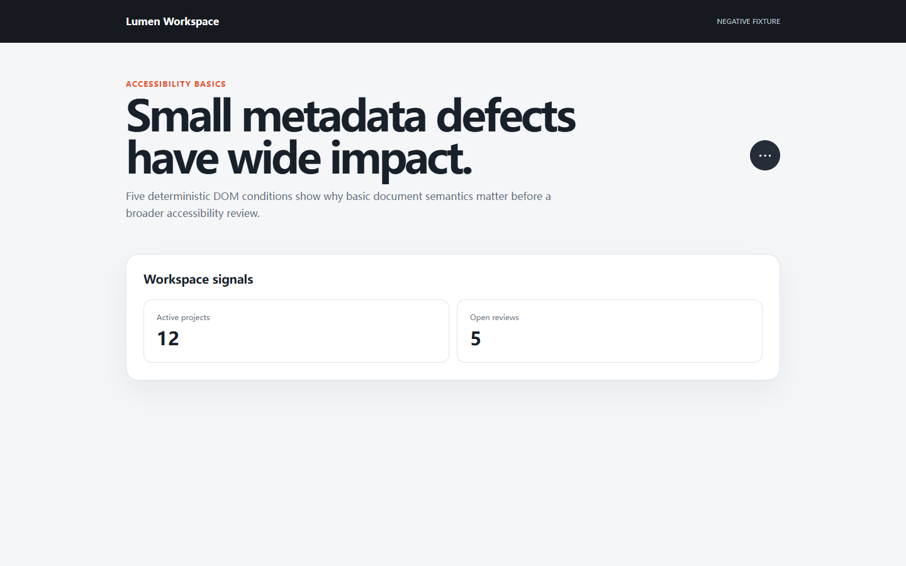

# RealityCheck report

- **Score:** 69/100
- **Target:** `http://127.0.0.1:4182/examples/accessibility-lab/broken.html`
- **Mode:** deep
- **Adapter:** project-playwright (fresh-context)
- **Run:** `20260804T163538Z-d26d37`
- **Threshold:** major - FAILED

> Automated checks cover only the recorded scenarios and cannot prove the absence of bugs or complete WCAG compliance.

## Release gate reasons

- 5 active finding(s) met the configured severity threshold; expected 0.

## Summary

| Critical | Major | Minor | Info | Baseline penalty | Chaos penalty |
| ---: | ---: | ---: | ---: | ---: | ---: |
| 1 | 4 | 5 | 0 | 30.75 | 0.0 |

## Scenarios

| Scenario | Status | Duration | Notes |
| --- | --- | ---: | --- |
| `baseline` | completed-with-findings | 1034 ms | Baseline runtime findings were recorded. |
| `mobile-375` | passed | 649 ms | - |
| `long-text` | passed | 1180 ms | 3 deterministic text mutations were applied. |
| `rtl-arabic` | passed | 1474 ms | Directionality stress test only; translation quality was not assessed. |
| `image-failure` | passed | 911 ms | Expected image request aborts were excluded from failed-request findings. |
| `keyboard-tab` | passed | 901 ms | No controls were activated or submitted. |
| `page-zoom-200` | unsupported | 0 ms | Real page zoom is not exposed by the standalone adapter. |
| `reduced-motion` | passed | 669 ms | Observed 0 persistent non-progress animation(s). |
| `dark-scheme` | skipped | 804 ms | No declared prefers-color-scheme: dark rule was found. |
| `slow-api` | skipped | 842 ms | No safe same-origin API request was observed. |
| `api-error` | skipped | 823 ms | No safe same-origin API request was observed. |
| `empty-data` | skipped | 797 ms | No safe JSON array response was observed. |
| `axe` | completed-with-findings | 792 ms | Bundled axe-core evaluated WCAG A/AA and best-practice rules; 5 violation rule(s) were recorded with at most five sampled nodes each. Automated scanning does not establish WCAG conformance. |

## Findings

### Buttons must have discernible text

`RC-DD7B086A3B` | **CRITICAL** | high confidence | existing | `axe`

Ensure buttons have discernible text Axe-core matched 1 node(s) with critical impact.

- Rule: `axe-button-name`
- URL: `http://127.0.0.1:4182/examples/accessibility-lab/broken.html`
- Element: `button`

Measurements:

    {
      "axeRule": "button-name",
      "impact": "critical",
      "nodeCount": 1,
      "sampledNodes": 1,
      "tags": [
        "cat.name-role-value",
        "wcag2a",
        "wcag412",
        "section508",
        "section508.22.a",
        "TTv5",
        "TT6.a",
        "EN-301-549",
        "EN-9.4.1.2",
        "ACT",
        "RGAAv4",
        "RGAA-11.9.1"
      ]
    }

Evidence:

- **axe-node:** {"failureSummary": "Fix any of the following:\n  Element does not have inner text that is visible to screen readers\n  aria-label attribute does not exist or is empty\n  aria-labelledby attribute does not exist, references elements that do not exist or references elements that are empty\n  Element has no title attribute\n  Element does not have an implicit (wrapped) &lt;label&gt;\n  Element does not have an explicit &lt;label&gt;\n  Element's default semantics were not overridden with role=\"none\" or role=\"presentation\"", "impact": "critical", "target": ["button"]}

Reproduce:

1. Open the page in a fresh browser context.
2. Run the bundled axe-core button-name rule and inspect the sampled targets.

Recommended fix:

Buttons must have discernible text
- Fix any of the following:   Element does not have inner text that is visible to screen readers   aria-label attribute does not exist or is empty   aria-labelledby attribute does not exist, references elements that do not exist or references elements that are empty   Element has no title attribute   Element does not have an implicit (wrapped) &lt;label&gt;   Element does not have an explicit &lt;label&gt;   Element's default semantics were not overridden with role="none" or role="presentation"
- Rule guidance: https://dequeuniversity.com/rules/axe/4.12/button-name?application=axeAPI

---

### Elements must meet minimum color contrast ratio thresholds

`RC-6BE52B2D95` | **MAJOR** | high confidence | existing | `axe`

Ensure the contrast between foreground and background colors meets WCAG 2 AA minimum contrast ratio thresholds Axe-core matched 1 node(s) with serious impact.

- Rule: `axe-color-contrast`
- URL: `http://127.0.0.1:4182/examples/accessibility-lab/broken.html`
- Element: `.eyebrow`

Measurements:

    {
      "axeRule": "color-contrast",
      "impact": "serious",
      "nodeCount": 1,
      "sampledNodes": 1,
      "tags": [
        "cat.color",
        "wcag2aa",
        "wcag143",
        "TTv5",
        "TT13.c",
        "EN-301-549",
        "EN-9.1.4.3",
        "ACT",
        "RGAAv4",
        "RGAA-3.2.1"
      ]
    }

Evidence:

- **axe-node:** {"failureSummary": "Fix any of the following:\n  Element has insufficient color contrast of 3.49 (foreground color: #e74f2b, background color: #f4f6f8, font size: 9.0pt (12px), font weight: bold). Expected contrast ratio of 4.5:1", "impact": "serious", "target": [".eyebrow"]}

Reproduce:

1. Open the page in a fresh browser context.
2. Run the bundled axe-core color-contrast rule and inspect the sampled targets.

Recommended fix:

Elements must meet minimum color contrast ratio thresholds
- Fix any of the following:   Element has insufficient color contrast of 3.49 (foreground color: #e74f2b, background color: #f4f6f8, font size: 9.0pt (12px), font weight: bold). Expected contrast ratio of 4.5:1
- Rule guidance: https://dequeuniversity.com/rules/axe/4.12/color-contrast?application=axeAPI

---

### Documents must have &lt;title&gt; element to aid in navigation

`RC-AFEF454665` | **MAJOR** | high confidence | existing | `axe`

Ensure each HTML document contains a non-empty &lt;title&gt; element Axe-core matched 1 node(s) with serious impact.

- Rule: `axe-document-title`
- URL: `http://127.0.0.1:4182/examples/accessibility-lab/broken.html`
- Element: `html`

Measurements:

    {
      "axeRule": "document-title",
      "impact": "serious",
      "nodeCount": 1,
      "sampledNodes": 1,
      "tags": [
        "cat.text-alternatives",
        "wcag2a",
        "wcag242",
        "TTv5",
        "TT12.a",
        "EN-301-549",
        "EN-9.2.4.2",
        "ACT",
        "RGAAv4",
        "RGAA-8.5.1"
      ]
    }

Evidence:

- **axe-node:** {"failureSummary": "Fix any of the following:\n  Document does not have a non-empty &lt;title&gt; element", "impact": "serious", "target": ["html"]}

Reproduce:

1. Open the page in a fresh browser context.
2. Run the bundled axe-core document-title rule and inspect the sampled targets.

Recommended fix:

Documents must have &lt;title&gt; element to aid in navigation
- Fix any of the following:   Document does not have a non-empty &lt;title&gt; element
- Rule guidance: https://dequeuniversity.com/rules/axe/4.12/document-title?application=axeAPI

---

### &lt;html&gt; element must have a lang attribute

`RC-26D6D6BE2D` | **MAJOR** | high confidence | existing | `axe`

Ensure every HTML document has a lang attribute Axe-core matched 1 node(s) with serious impact.

- Rule: `axe-html-has-lang`
- URL: `http://127.0.0.1:4182/examples/accessibility-lab/broken.html`
- Element: `html`

Measurements:

    {
      "axeRule": "html-has-lang",
      "impact": "serious",
      "nodeCount": 1,
      "sampledNodes": 1,
      "tags": [
        "cat.language",
        "wcag2a",
        "wcag311",
        "TTv5",
        "TT11.a",
        "EN-301-549",
        "EN-9.3.1.1",
        "ACT",
        "RGAAv4",
        "RGAA-8.3.1"
      ]
    }

Evidence:

- **axe-node:** {"failureSummary": "Fix any of the following:\n  The &lt;html&gt; element does not have a lang attribute", "impact": "serious", "target": ["html"]}

Reproduce:

1. Open the page in a fresh browser context.
2. Run the bundled axe-core html-has-lang rule and inspect the sampled targets.

Recommended fix:

&lt;html&gt; element must have a lang attribute
- Fix any of the following:   The &lt;html&gt; element does not have a lang attribute
- Rule guidance: https://dequeuniversity.com/rules/axe/4.12/html-has-lang?application=axeAPI

---

### An interactive control has no accessible name

`RC-2467435352` | **MAJOR** | medium confidence | existing | `baseline`

The visible control exposes no label through native text, an associated label, alt text, title, aria-label, or aria-labelledby.

- Rule: `control-accessible-name`
- URL: `http://127.0.0.1:4182/examples/accessibility-lab/broken.html`
- Element: `button.icon-button`

Measurements:

    {
      "boundingBox": {
        "bottom": 271,
        "height": 48,
        "right": 1240,
        "width": 48,
        "x": 1192,
        "y": 223
      },
      "hasAccessibleName": false,
      "role": null,
      "tag": "button"
    }

Evidence:

- **dom:** {"boundingBox": {"bottom": 271, "height": 48, "right": 1240, "width": 48, "x": 1192, "y": 223}, "hasAccessibleName": false, "selector": "button.icon-button"}

Reproduce:

1. Open the page in a clean browser context.
2. Inspect the accessible name exposed by button.icon-button.

Recommended fix:

Give the control a concise programmatic name using visible text or native labeling first.
- Prefer a native &lt;label&gt;, button text, or alt text before adding ARIA.

---

### Heading levels should only increase by one

`RC-FD6828C986` | **MINOR** | high confidence | existing | `axe`

Ensure the order of headings is semantically correct Axe-core matched 1 node(s) with moderate impact.

- Rule: `axe-heading-order`
- URL: `http://127.0.0.1:4182/examples/accessibility-lab/broken.html`
- Element: `#section-title`

Measurements:

    {
      "axeRule": "heading-order",
      "impact": "moderate",
      "nodeCount": 1,
      "sampledNodes": 1,
      "tags": [
        "cat.semantics",
        "best-practice"
      ]
    }

Evidence:

- **axe-node:** {"failureSummary": "Fix any of the following:\n  Heading order invalid", "impact": "moderate", "target": ["#section-title"]}

Reproduce:

1. Open the page in a fresh browser context.
2. Run the bundled axe-core heading-order rule and inspect the sampled targets.

Recommended fix:

Heading levels should only increase by one
- Fix any of the following:   Heading order invalid
- Rule guidance: https://dequeuniversity.com/rules/axe/4.12/heading-order?application=axeAPI

---

### The document does not declare its language

`RC-32F9E9CDA5` | **MINOR** | high confidence | existing | `baseline`

The root html element has no non-empty lang attribute, so assistive technology cannot reliably select pronunciation rules.

- Rule: `document-language-missing`
- URL: `http://127.0.0.1:4182/examples/accessibility-lab/broken.html`
- Element: `html`

Measurements:

    {
      "language": ""
    }

Evidence:

- **dom:** {"attribute": "lang", "selector": "html", "value": ""}

Reproduce:

1. Open the page in a clean browser context.
2. Inspect the lang attribute on the root html element.

Recommended fix:

Declare the page's primary BCP 47 language tag on the root html element.
- Use a specific tag such as en, zh-CN, or ar and update it when the document language changes.

---

### The document has no page title

`RC-D7DABBAD48` | **MINOR** | high confidence | existing | `baseline`

The browser title is empty, which makes tabs, history, and assistive navigation difficult to distinguish.

- Rule: `document-title-missing`
- URL: `http://127.0.0.1:4182/examples/accessibility-lab/broken.html`
- Element: `title`

Measurements:

    {
      "titleLength": 0
    }

Evidence:

- **dom:** {"selector": "title", "textLength": 0}

Reproduce:

1. Open the page in a clean browser context.
2. Inspect document.title after the page settles.

Recommended fix:

Add a concise, route-specific title that identifies the page and product.

---

### The document contains duplicate element IDs

`RC-BF257020C1` | **MINOR** | high confidence | existing | `baseline`

1 duplicated ID value(s) can make labels, fragments, and DOM references resolve to the wrong element.

- Rule: `duplicate-element-id`
- URL: `http://127.0.0.1:4182/examples/accessibility-lab/broken.html`
- Element: `#metric`

Measurements:

    {
      "duplicates": [
        {
          "count": 2,
          "id": "metric"
        }
      ]
    }

Evidence:

- **dom:** {"duplicates": [{"count": 2, "id": "metric"}]}

Reproduce:

1. Open the page in a clean browser context.
2. Count every non-empty id value and identify values used more than once.

Recommended fix:

Give every document ID a unique stable value and update all label, fragment, and ARIA references.

---

### Visible heading levels skip part of the hierarchy

`RC-D5EA851B96` | **MINOR** | medium confidence | existing | `baseline`

A level 1 heading is followed by level 3, which may obscure the document structure.

- Rule: `heading-level-skip`
- URL: `http://127.0.0.1:4182/examples/accessibility-lab/broken.html`
- Element: `#section-title`

Measurements:

    {
      "skips": [
        {
          "current": {
            "level": 3,
            "selector": "#section-title",
            "text": "Workspace signals"
          },
          "previous": {
            "level": 1,
            "selector": "body > main > section:nth-of-type(1) > div > h1",
            "text": "Small metadata defects have wide impact."
          }
        }
      ]
    }

Evidence:

- **dom:** {"headingSkips": [{"current": {"level": 3, "selector": "#section-title", "text": "Workspace signals"}, "previous": {"level": 1, "selector": "body &gt; main &gt; section:nth-of-type(1) &gt; div &gt; h1", "text": "Small metadata defects have wide impact."}}]}

Reproduce:

1. Open the page in a clean browser context.
2. Read visible h1–h6 elements in DOM order and compare adjacent levels.

Recommended fix:

Use heading levels to represent the document outline without skipping an intermediate level.
- Change visual size with CSS rather than choosing a heading level for appearance.

---

## Coverage warnings

- Standalone audit used an already-installed system browser (150.0.7871.116).
- Automated findings remain bounded observations; review low-confidence items before fixing.
- Bundled axe-core checks supplement scenario testing but cannot establish complete WCAG conformance.

## Run metadata

- Started: 2026-08-04T16:35:38.077Z
- Finished: 2026-08-04T16:35:49.111Z
- Duration: 11014 ms
- Tool version: 0.4.0
- Schema version: 1
