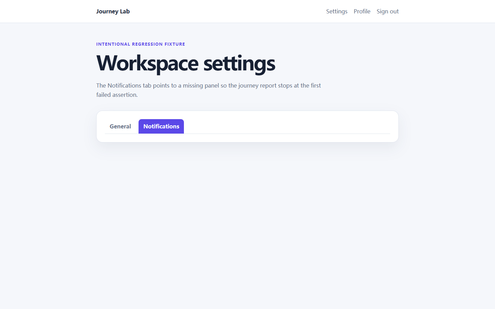

# RealityCheck report

- **Score:** 96/100
- **Target:** `http://127.0.0.1:4182/examples/journey-lab/broken.html`
- **Mode:** quick
- **Adapter:** project-playwright (fresh-context)
- **Run:** `20260804T163538Z-34ea95`
- **Threshold:** major - FAILED

> Automated checks cover only the recorded scenarios and cannot prove the absence of bugs or complete WCAG compliance.

## Release gate reasons

- 1 active finding(s) met the configured severity threshold; expected 0.

## Summary

| Critical | Major | Minor | Info | Baseline penalty | Chaos penalty |
| ---: | ---: | ---: | ---: | ---: | ---: |
| 0 | 1 | 0 | 0 | 4.0 | 0.0 |

## Scenarios

| Scenario | Status | Duration | Notes |
| --- | --- | ---: | --- |
| `baseline` | passed | 814 ms | - |
| `mobile-375` | passed | 665 ms | - |
| `long-text` | passed | 1300 ms | 8 deterministic text mutations were applied. |
| `rtl-arabic` | passed | 1303 ms | Directionality stress test only; translation quality was not assessed. |
| `image-failure` | passed | 742 ms | Expected image request aborts were excluded from failed-request findings. |
| `keyboard-tab` | passed | 984 ms | No controls were activated or submitted. |
| `journey-settings-notifications` | completed-with-findings | 1294 ms | Stopped safely at step 2; no form was submitted. |

## Findings

### User journey failed: Settings notifications remain usable

`RC-0F3087966F` | **MAJOR** | high confidence | existing | `journey-settings-notifications`

Step 2 (assert) did not complete: Assertion visible failed for #notifications

- Rule: `journey-settings-notifications`
- URL: `http://127.0.0.1:4182/examples/journey-lab/broken.html`
- Element: `#notifications`

Measurements:

    {
      "completedSteps": 1,
      "failedAction": "assert",
      "failedStep": 2,
      "finalPath": "/examples/journey-lab/broken.html",
      "totalSteps": 2
    }

Evidence:

- **journey-trace:** {"steps": [{"action": "click", "element": "button", "passed": true, "selector": "[role=tab][aria-controls=notifications]", "step": 1}, {"action": "assert", "assertion": "visible", "count": 0, "passed": false, "selector": "#notifications", "step": 2, "visibleCount": 0}, {"action": "assert", "passed": false, "reason": "Assertion visible failed for #notifications", "selector": "#notifications", "step": 2}]}

Reproduce:

1. Open the journey at /examples/journey-lab/broken.html in a fresh isolated context.
2. 1. click [role=tab][aria-controls=notifications].
3. 2. assert #notifications (visible).

Recommended fix:

Restore the first failed application state or transition; keep the journey assertion unchanged and rerun the entire journey.
- Use the step trace and failure screenshot to distinguish a missing state from a blocked transition.

---

## Coverage warnings

- Standalone audit used an already-installed system browser (150.0.7871.116).
- Automated findings remain bounded observations; review low-confidence items before fixing.
- 1 declarative user journey(s) were executed with same-origin and non-submission safety guards.

## Run metadata

- Started: 2026-08-04T16:35:38.059Z
- Finished: 2026-08-04T16:35:45.268Z
- Duration: 7191 ms
- Tool version: 0.4.0
- Schema version: 1
