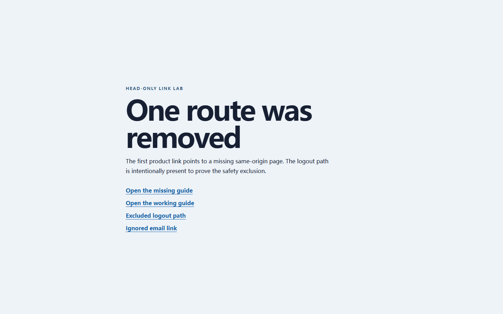

# RealityCheck report

- **Score:** 96/100
- **Target:** `http://127.0.0.1:4182/examples/link-lab/broken.html`
- **Mode:** quick
- **Adapter:** project-playwright (fresh-context)
- **Run:** `20260804T171908Z-faed61`
- **Threshold:** major - FAILED

> Automated checks cover only the recorded scenarios and cannot prove the absence of bugs or complete WCAG compliance.

## Release gate reasons

- 1 active finding(s) met the configured severity threshold; expected 0.

## Summary

| Critical | Major | Minor | Info | Baseline penalty | Chaos penalty |
| ---: | ---: | ---: | ---: | ---: | ---: |
| 0 | 1 | 0 | 0 | 4.0 | 0.0 |

## Scenarios

| Scenario | Status | Duration | Notes |
| --- | --- | ---: | --- |
| `baseline` | completed-with-findings | 626 ms | Baseline runtime findings were recorded. |
| `mobile-375` | passed | 568 ms | - |
| `long-text` | passed | 1209 ms | 5 deterministic text mutations were applied. |
| `rtl-arabic` | passed | 1053 ms | Directionality stress test only; translation quality was not assessed. |
| `image-failure` | passed | 580 ms | Expected image request aborts were excluded from failed-request findings. |
| `keyboard-tab` | passed | 966 ms | No controls were activated or submitted. |

## Findings

### Broken same-origin links exceed the project budget

`RC-D9B4C0700C` | **MAJOR** | high confidence | existing | `baseline`

1 safely checked same-origin link(s) failed, above the configured maximum of 0.

- Rule: `link-integrity-failure-budget`
- URL: `http://127.0.0.1:4182/examples/link-lab/broken.html`

Measurements:

    {
      "checked": 2,
      "discovered": 4,
      "eligible": 2,
      "excluded": 1,
      "failures": 1,
      "limit": 0,
      "maxRedirects": 5,
      "method": "HEAD",
      "passed": 1,
      "statusCounts": {
        "200": 1,
        "404": 1
      },
      "timeoutMs": 3000,
      "truncated": 0,
      "unsupported": 0
    }

Evidence:

- **link-integrity:** {"checked": 2, "discovered": 4, "eligible": 2, "excluded": 1, "failureSamples": [{"reason": "http-error", "redirects": [], "status": 404, "url": "http://127.0.0.1:4182/examples/link-lab/missing-guide.html"}], "failures": 1, "limit": 0, "method": "HEAD", "passed": 1, "statusCounts": {"200": 1, "404": 1}, "truncated": 0, "unsupported": 0}

Reproduce:

1. Open the page in a fresh context without activating any link.
2. Collect bounded same-origin anchor targets after the page settles.
3. Issue HEAD requests only, following at most five same-origin allowed redirects, and compare failures with the configured limit.

Recommended fix:

Correct or remove every sampled broken href, preserve intentional redirects, and rerun the same link policy without increasing its failure allowance.
- HEAD 405/501 responses are recorded as unsupported rather than broken; verify those endpoints manually or make their HEAD behavior standards-compatible.

---

## Coverage warnings

- Standalone audit used an already-installed system browser (150.0.7871.116).
- Automated findings remain bounded observations; review low-confidence items before fixing.
- Link integrity checked 2 same-origin target(s) with HEAD only: 1 failed, 0 did not support HEAD, 1 were excluded by safety policy, and 0 exceeded the configured cap.

## Run metadata

- Started: 2026-08-04T17:19:08.167Z
- Finished: 2026-08-04T17:19:13.253Z
- Duration: 5072 ms
- Tool version: 0.4.0
- Schema version: 1
