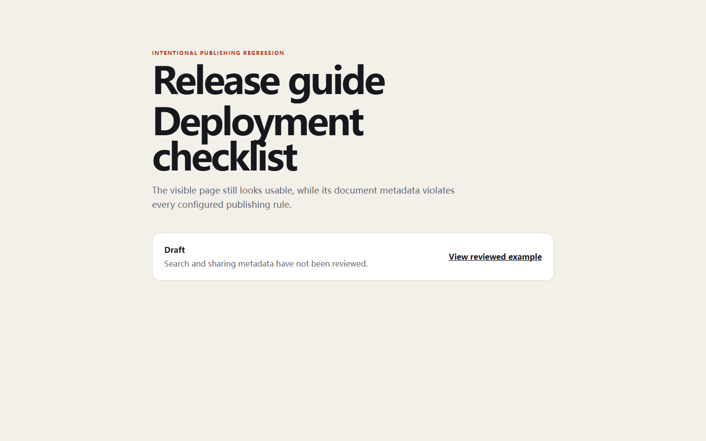

# RealityCheck report

- **Score:** 75/100
- **Target:** `http://127.0.0.1:4182/examples/metadata-lab/broken.html`
- **Mode:** quick
- **Adapter:** project-playwright (fresh-context)
- **Run:** `20260804T180133Z-00ac02`
- **Threshold:** major - FAILED

> Automated checks cover only the recorded scenarios and cannot prove the absence of bugs or complete WCAG compliance.

## Release gate reasons

- 6 active finding(s) met the configured severity threshold; expected 0.

## Summary

| Critical | Major | Minor | Info | Baseline penalty | Chaos penalty |
| ---: | ---: | ---: | ---: | ---: | ---: |
| 0 | 6 | 1 | 0 | 25.5 | 0.0 |

## Scenarios

| Scenario | Status | Duration | Notes |
| --- | --- | ---: | --- |
| `baseline` | completed-with-findings | 602 ms | Baseline runtime findings were recorded. |
| `mobile-375` | passed | 569 ms | - |
| `long-text` | passed | 1166 ms | 4 deterministic text mutations were applied. |
| `rtl-arabic` | passed | 1070 ms | Directionality stress test only; translation quality was not assessed. |
| `image-failure` | passed | 830 ms | Expected image request aborts were excluded from failed-request findings. |
| `keyboard-tab` | passed | 991 ms | No controls were activated or submitted. |

## Findings

### Canonical link is missing, duplicated, or invalid

`RC-51D4CB4D14` | **MAJOR** | high confidence | existing | `baseline`

Found 0 canonical link(s); policy requires exactly one valid HTTP(S) destination.

- Rule: `metadata-canonical`
- URL: `http://127.0.0.1:4182/examples/metadata-lab/broken.html`
- Element: `link[rel~="canonical"]`

Measurements:

    {
      "count": 0,
      "destinations": []
    }

Evidence:

- **metadata-policy:** {"count": 0, "destinations": [], "policy": "canonical link"}

Reproduce:

1. Open the page in a fresh context.
2. Inspect the document canonical link state without retaining title or description text.

Recommended fix:

Emit exactly one reviewed absolute canonical URL for this document.

---

### Meta description does not meet the publishing policy

`RC-FC9B00B542` | **MAJOR** | high confidence | existing | `baseline`

Found 0 description element(s) with a first length of 0; expected exactly one and 50–180 characters.

- Rule: `metadata-description-length`
- URL: `http://127.0.0.1:4182/examples/metadata-lab/broken.html`
- Element: `meta[name="description"]`

Measurements:

    {
      "count": 0,
      "length": 0,
      "maximum": 180,
      "minimum": 50
    }

Evidence:

- **metadata-policy:** {"count": 0, "length": 0, "maximum": 180, "minimum": 50, "policy": "meta description length"}

Reproduce:

1. Open the page in a fresh context.
2. Inspect the document meta description length state without retaining title or description text.

Recommended fix:

Add one accurate, page-specific meta description within the configured range; do not stuff keywords.

---

### Page does not expose exactly one primary heading

`RC-DE543A763E` | **MAJOR** | high confidence | existing | `baseline`

Found 2 h1 element(s); publishing policy requires exactly one.

- Rule: `metadata-h1-count`
- URL: `http://127.0.0.1:4182/examples/metadata-lab/broken.html`
- Element: `h1`

Measurements:

    {
      "h1": 2
    }

Evidence:

- **metadata-policy:** {"h1": 2, "policy": "primary heading count"}

Reproduce:

1. Open the page in a fresh context.
2. Inspect the document primary heading count state without retaining title or description text.

Recommended fix:

Keep one page-specific h1 and demote or consolidate competing top-level headings without hiding content.

---

### Page is marked noindex against publishing policy

`RC-BF5823BDC5` | **MAJOR** | high confidence | existing | `baseline`

A robots directive contains noindex on a route configured for indexable publication.

- Rule: `metadata-robots-noindex`
- URL: `http://127.0.0.1:4182/examples/metadata-lab/broken.html`
- Element: `meta[name="robots"]`

Measurements:

    {
      "declarations": 1,
      "noindex": true
    }

Evidence:

- **metadata-policy:** {"declarations": 1, "noindex": true, "policy": "robots indexing directive"}

Reproduce:

1. Open the page in a fresh context.
2. Inspect the document robots indexing directive state without retaining title or description text.

Recommended fix:

Remove noindex only after confirming this route is intended for public indexing and no equivalent header blocks it.

---

### Document title does not meet the publishing policy

`RC-4CA707B13D` | **MAJOR** | high confidence | existing | `baseline`

Found 1 title element(s) with a rendered length of 1; expected exactly one and 10–70 characters.

- Rule: `metadata-title-length`
- URL: `http://127.0.0.1:4182/examples/metadata-lab/broken.html`
- Element: `title`

Measurements:

    {
      "count": 1,
      "length": 1,
      "maximum": 70,
      "minimum": 10
    }

Evidence:

- **metadata-policy:** {"count": 1, "length": 1, "maximum": 70, "minimum": 10, "policy": "title length"}

Reproduce:

1. Open the page in a fresh context.
2. Inspect the document title length state without retaining title or description text.

Recommended fix:

Provide one concise, page-specific title within the configured length range.

---

### Responsive viewport metadata is missing or ambiguous

`RC-12B8E2C4B7` | **MAJOR** | high confidence | existing | `baseline`

Found 0 viewport declaration(s); exactly one width=device-width declaration is required.

- Rule: `metadata-viewport`
- URL: `http://127.0.0.1:4182/examples/metadata-lab/broken.html`
- Element: `meta[name="viewport"]`

Measurements:

    {
      "count": 0,
      "deviceWidth": false
    }

Evidence:

- **metadata-policy:** {"count": 0, "deviceWidth": false, "policy": "viewport declaration"}

Reproduce:

1. Open the page in a fresh context.
2. Inspect the document viewport declaration state without retaining title or description text.

Recommended fix:

Provide one reviewed viewport declaration that includes width=device-width.

---

### The document does not declare its language

`RC-1121CA3B1F` | **MINOR** | high confidence | existing | `baseline`

The root html element has no non-empty lang attribute, so assistive technology cannot reliably select pronunciation rules.

- Rule: `document-language-missing`
- URL: `http://127.0.0.1:4182/examples/metadata-lab/broken.html`
- Element: `html`

Measurements:

    {
      "language": ""
    }

Evidence:

- **dom:** {"attribute": "lang", "selector": "html", "value": ""}

Reproduce:

1. Open the page in a clean browser context.
2. Inspect the lang attribute on the root html element.

Recommended fix:

Declare the page's primary BCP 47 language tag on the root html element.
- Use a specific tag such as en, zh-CN, or ar and update it when the document language changes.

---

## Coverage warnings

- Standalone audit used an already-installed system browser (150.0.7871.116).
- Automated findings remain bounded observations; review low-confidence items before fixing.
- 9 explicit publishing metadata rule(s) were evaluated from counts, lengths, directives, and query-free destinations without retaining title or description text.

## Run metadata

- Started: 2026-08-04T18:01:33.976Z
- Finished: 2026-08-04T18:01:39.298Z
- Duration: 5307 ms
- Tool version: 0.4.0
- Schema version: 1
