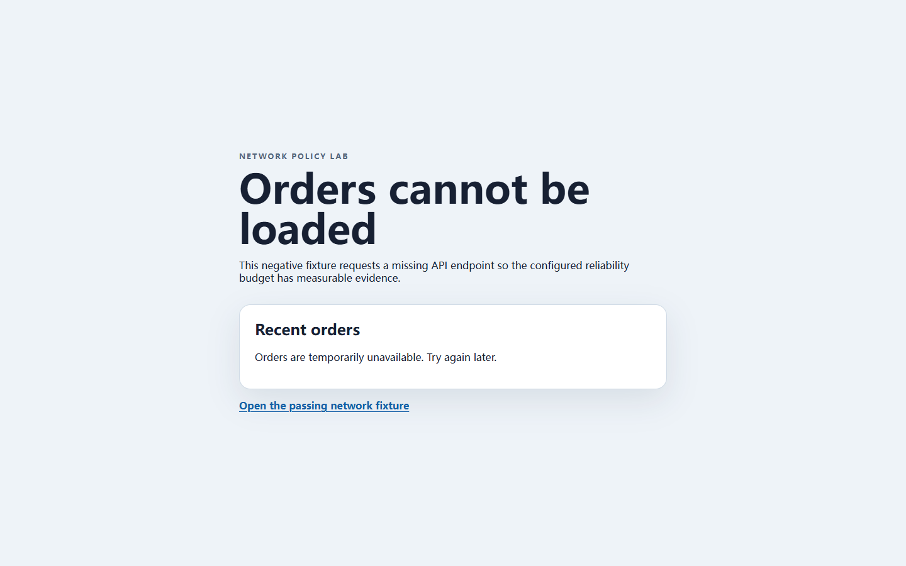

# RealityCheck report

- **Score:** 96/100
- **Target:** `http://127.0.0.1:4182/examples/network-lab/broken.html`
- **Mode:** quick
- **Adapter:** project-playwright (fresh-context)
- **Run:** `20260804T165903Z-d3b2e3`
- **Threshold:** major - FAILED

> Automated checks cover only the recorded scenarios and cannot prove the absence of bugs or complete WCAG compliance.

## Release gate reasons

- 1 active finding(s) met the configured severity threshold; expected 0.

## Summary

| Critical | Major | Minor | Info | Baseline penalty | Chaos penalty |
| ---: | ---: | ---: | ---: | ---: | ---: |
| 0 | 1 | 0 | 0 | 4.0 | 0.0 |

## Scenarios

| Scenario | Status | Duration | Notes |
| --- | --- | ---: | --- |
| `baseline` | completed-with-findings | 796 ms | Baseline runtime findings were recorded. |
| `mobile-375` | passed | 651 ms | - |
| `long-text` | passed | 1105 ms | 3 deterministic text mutations were applied. |
| `rtl-arabic` | passed | 1037 ms | Directionality stress test only; translation quality was not assessed. |
| `image-failure` | passed | 841 ms | Expected image request aborts were excluded from failed-request findings. |
| `keyboard-tab` | passed | 781 ms | No controls were activated or submitted. |

## Findings

### HTTP error responses exceed the network reliability budget

`RC-55552DF828` | **MAJOR** | high confidence | existing | `baseline`

1 in-scope request(s) returned HTTP 4xx/5xx responses, above the configured maximum of 0.

- Rule: `network-http-error-budget`
- URL: `http://127.0.0.1:4182/examples/network-lab/broken.html`

Measurements:

    {
      "actual": 1,
      "limit": 0,
      "scope": "api",
      "statuses": {
        "404": 1
      }
    }

Evidence:

- **network-policy:** {"actual": 1, "limit": 0, "policy": "network-http-error-budget", "samples": [{"durationMs": 82, "method": "GET", "origin": "http://127.0.0.1:4182", "resourceType": "fetch", "status": 404, "url": "http://127.0.0.1:4182/examples/network-lab/missing-orders.json"}], "scope": "api"}

Reproduce:

1. Open the target in a fresh browser context with an empty cache.
2. Observe XHR and fetch requests until the page settles, then compare the recorded count with the configured limit.

Recommended fix:

Restore each application-owned endpoint or remove the request intentionally; document an exception instead of hiding a known failure.
- Start with 5xx responses and XHR/fetch calls on the critical path.

---

## Coverage warnings

- Standalone audit used an already-installed system browser (150.0.7871.116).
- Automated findings remain bounded observations; review low-confidence items before fixing.
- 4 explicit network reliability limit(s) were evaluated without persisting response bodies or query values.

## Run metadata

- Started: 2026-08-04T16:59:03.576Z
- Finished: 2026-08-04T16:59:08.864Z
- Duration: 5274 ms
- Tool version: 0.4.0
- Schema version: 1
