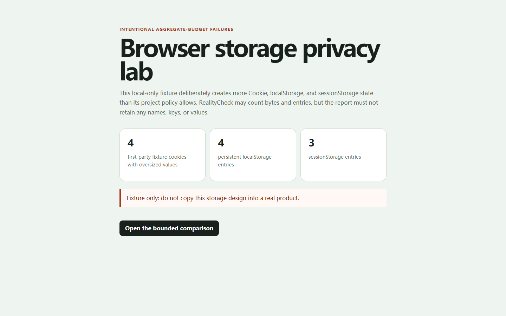

# RealityCheck report

- **Score:** 76/100
- **Target:** `http://127.0.0.1:4182/examples/privacy-lab/broken.html`
- **Mode:** quick
- **Adapter:** project-playwright (fresh-context)
- **Run:** `20260804T205848Z-25ccf3`
- **Threshold:** major - FAILED

> Automated checks cover only the recorded scenarios and cannot prove the absence of bugs or complete WCAG compliance.

## Release gate reasons

- 6 active finding(s) met the configured severity threshold; expected 0.

## Summary

| Critical | Major | Minor | Info | Baseline penalty | Chaos penalty |
| ---: | ---: | ---: | ---: | ---: | ---: |
| 0 | 6 | 0 | 0 | 24.0 | 0.0 |

## Scenarios

| Scenario | Status | Duration | Notes |
| --- | --- | ---: | --- |
| `baseline` | completed-with-findings | 726 ms | Baseline runtime findings were recorded. |
| `mobile-375` | passed | 663 ms | Evaluated 375×812; touch-target checks were enabled. |
| `long-text` | passed | 1286 ms | 5 deterministic text mutations were applied. |
| `rtl-arabic` | passed | 1052 ms | Directionality stress test only; translation quality was not assessed. |
| `image-failure` | passed | 614 ms | Expected image request aborts were excluded from failed-request findings. |
| `keyboard-tab` | passed | 700 ms | No controls were activated or submitted. |

## Findings

### Cookie bytes exceed the project privacy budget

`RC-58CF6DE19B` | **MAJOR** | high confidence | existing | `baseline`

The isolated baseline measured 368 cookie byte(s), above the configured maximum of 120.

- Rule: `privacy-cookie-byte-budget`
- URL: `http://127.0.0.1:4182/examples/privacy-lab/broken.html`
- Element: `html`

Measurements:

    {
      "actual": 368,
      "aggregate": {
        "cookieSummary": {
          "available": true,
          "bytes": 368,
          "count": 4,
          "thirdPartyCount": 0
        },
        "localStorage": {
          "available": true,
          "bytes": 1136,
          "entries": 4
        },
        "sessionStorage": {
          "available": true,
          "bytes": 654,
          "entries": 3
        }
      },
      "limit": 120,
      "metric": "maxCookieBytes"
    }

Evidence:

- **privacy-budget:** {"actual": 368, "aggregate": {"cookieSummary": {"available": true, "bytes": 368, "count": 4, "thirdPartyCount": 0}, "localStorage": {"available": true, "bytes": 1136, "entries": 4}, "sessionStorage": {"available": true, "bytes": 654, "entries": 3}}, "limit": 120, "metric": "maxCookieBytes", "state": "exceeded"}

Reproduce:

1. Open the page in a fresh browser context.
2. Measure only aggregate maxCookieBytes usage after the baseline settles.

Recommended fix:

Reduce application-owned cookie payloads and avoid storing unnecessary state in cookies; do not delete authentication state without product review.
- RealityCheck intentionally does not retain cookie names, values, storage keys, or storage values.

---

### Cookie count exceeds the project privacy budget

`RC-F162EB3E74` | **MAJOR** | high confidence | existing | `baseline`

The isolated baseline measured 4 cookie(s), above the configured maximum of 2.

- Rule: `privacy-cookie-count-budget`
- URL: `http://127.0.0.1:4182/examples/privacy-lab/broken.html`
- Element: `html`

Measurements:

    {
      "actual": 4,
      "aggregate": {
        "cookieSummary": {
          "available": true,
          "bytes": 368,
          "count": 4,
          "thirdPartyCount": 0
        },
        "localStorage": {
          "available": true,
          "bytes": 1136,
          "entries": 4
        },
        "sessionStorage": {
          "available": true,
          "bytes": 654,
          "entries": 3
        }
      },
      "limit": 2,
      "metric": "maxCookies"
    }

Evidence:

- **privacy-budget:** {"actual": 4, "aggregate": {"cookieSummary": {"available": true, "bytes": 368, "count": 4, "thirdPartyCount": 0}, "localStorage": {"available": true, "bytes": 1136, "entries": 4}, "sessionStorage": {"available": true, "bytes": 654, "entries": 3}}, "limit": 2, "metric": "maxCookies", "state": "exceeded"}

Reproduce:

1. Open the page in a fresh browser context.
2. Measure only aggregate maxCookies usage after the baseline settles.

Recommended fix:

Remove cookies that are not needed for the current product behavior, shorten their lifetime where appropriate, and rerun the audit.
- RealityCheck intentionally does not retain cookie names, values, storage keys, or storage values.

---

### localStorage bytes exceed the project privacy budget

`RC-4813EC95B4` | **MAJOR** | high confidence | existing | `baseline`

The isolated baseline measured 1136 localStorage byte(s), above the configured maximum of 300.

- Rule: `privacy-local-storage-byte-budget`
- URL: `http://127.0.0.1:4182/examples/privacy-lab/broken.html`
- Element: `html`

Measurements:

    {
      "actual": 1136,
      "aggregate": {
        "cookieSummary": {
          "available": true,
          "bytes": 368,
          "count": 4,
          "thirdPartyCount": 0
        },
        "localStorage": {
          "available": true,
          "bytes": 1136,
          "entries": 4
        },
        "sessionStorage": {
          "available": true,
          "bytes": 654,
          "entries": 3
        }
      },
      "limit": 300,
      "metric": "maxLocalStorageBytes"
    }

Evidence:

- **privacy-budget:** {"actual": 1136, "aggregate": {"cookieSummary": {"available": true, "bytes": 368, "count": 4, "thirdPartyCount": 0}, "localStorage": {"available": true, "bytes": 1136, "entries": 4}, "sessionStorage": {"available": true, "bytes": 654, "entries": 3}}, "limit": 300, "metric": "maxLocalStorageBytes", "state": "exceeded"}

Reproduce:

1. Open the page in a fresh browser context.
2. Measure only aggregate maxLocalStorageBytes usage after the baseline settles.

Recommended fix:

Minimize persistent client-side payloads and move only appropriate non-secret data to a reviewed storage design.
- RealityCheck intentionally does not retain cookie names, values, storage keys, or storage values.

---

### localStorage entries exceed the project privacy budget

`RC-C3D6AFC784` | **MAJOR** | high confidence | existing | `baseline`

The isolated baseline measured 4 localStorage entry/entries, above the configured maximum of 2.

- Rule: `privacy-local-storage-entry-budget`
- URL: `http://127.0.0.1:4182/examples/privacy-lab/broken.html`
- Element: `html`

Measurements:

    {
      "actual": 4,
      "aggregate": {
        "cookieSummary": {
          "available": true,
          "bytes": 368,
          "count": 4,
          "thirdPartyCount": 0
        },
        "localStorage": {
          "available": true,
          "bytes": 1136,
          "entries": 4
        },
        "sessionStorage": {
          "available": true,
          "bytes": 654,
          "entries": 3
        }
      },
      "limit": 2,
      "metric": "maxLocalStorageEntries"
    }

Evidence:

- **privacy-budget:** {"actual": 4, "aggregate": {"cookieSummary": {"available": true, "bytes": 368, "count": 4, "thirdPartyCount": 0}, "localStorage": {"available": true, "bytes": 1136, "entries": 4}, "sessionStorage": {"available": true, "bytes": 654, "entries": 3}}, "limit": 2, "metric": "maxLocalStorageEntries", "state": "exceeded"}

Reproduce:

1. Open the page in a fresh browser context.
2. Measure only aggregate maxLocalStorageEntries usage after the baseline settles.

Recommended fix:

Remove obsolete application-owned localStorage entries with a reviewed migration and retention plan.
- RealityCheck intentionally does not retain cookie names, values, storage keys, or storage values.

---

### sessionStorage bytes exceed the project privacy budget

`RC-FBF7A4842F` | **MAJOR** | high confidence | existing | `baseline`

The isolated baseline measured 654 sessionStorage byte(s), above the configured maximum of 240.

- Rule: `privacy-session-storage-byte-budget`
- URL: `http://127.0.0.1:4182/examples/privacy-lab/broken.html`
- Element: `html`

Measurements:

    {
      "actual": 654,
      "aggregate": {
        "cookieSummary": {
          "available": true,
          "bytes": 368,
          "count": 4,
          "thirdPartyCount": 0
        },
        "localStorage": {
          "available": true,
          "bytes": 1136,
          "entries": 4
        },
        "sessionStorage": {
          "available": true,
          "bytes": 654,
          "entries": 3
        }
      },
      "limit": 240,
      "metric": "maxSessionStorageBytes"
    }

Evidence:

- **privacy-budget:** {"actual": 654, "aggregate": {"cookieSummary": {"available": true, "bytes": 368, "count": 4, "thirdPartyCount": 0}, "localStorage": {"available": true, "bytes": 1136, "entries": 4}, "sessionStorage": {"available": true, "bytes": 654, "entries": 3}}, "limit": 240, "metric": "maxSessionStorageBytes", "state": "exceeded"}

Reproduce:

1. Open the page in a fresh browser context.
2. Measure only aggregate maxSessionStorageBytes usage after the baseline settles.

Recommended fix:

Reduce session-only payloads and keep sensitive data out of browser storage unless the design is explicitly reviewed.
- RealityCheck intentionally does not retain cookie names, values, storage keys, or storage values.

---

### sessionStorage entries exceed the project privacy budget

`RC-35F26228B0` | **MAJOR** | high confidence | existing | `baseline`

The isolated baseline measured 3 sessionStorage entry/entries, above the configured maximum of 2.

- Rule: `privacy-session-storage-entry-budget`
- URL: `http://127.0.0.1:4182/examples/privacy-lab/broken.html`
- Element: `html`

Measurements:

    {
      "actual": 3,
      "aggregate": {
        "cookieSummary": {
          "available": true,
          "bytes": 368,
          "count": 4,
          "thirdPartyCount": 0
        },
        "localStorage": {
          "available": true,
          "bytes": 1136,
          "entries": 4
        },
        "sessionStorage": {
          "available": true,
          "bytes": 654,
          "entries": 3
        }
      },
      "limit": 2,
      "metric": "maxSessionStorageEntries"
    }

Evidence:

- **privacy-budget:** {"actual": 3, "aggregate": {"cookieSummary": {"available": true, "bytes": 368, "count": 4, "thirdPartyCount": 0}, "localStorage": {"available": true, "bytes": 1136, "entries": 4}, "sessionStorage": {"available": true, "bytes": 654, "entries": 3}}, "limit": 2, "metric": "maxSessionStorageEntries", "state": "exceeded"}

Reproduce:

1. Open the page in a fresh browser context.
2. Measure only aggregate maxSessionStorageEntries usage after the baseline settles.

Recommended fix:

Remove obsolete session-only state and consolidate duplicated application-owned entries after reviewing navigation behavior.
- RealityCheck intentionally does not retain cookie names, values, storage keys, or storage values.

---

## Coverage warnings

- Standalone audit used an already-installed system browser (150.0.7871.116).
- Automated findings remain bounded observations; review low-confidence items before fixing.
- Responsive layout was evaluated in 1 configured viewport(s); touch-target heuristics ran only where touch was enabled.
- 7 aggregate cookie and Web Storage privacy budget(s) were evaluated without retaining cookie names, values, storage keys, or storage values.

## Run metadata

- Started: 2026-08-04T20:58:48.677Z
- Finished: 2026-08-04T20:58:53.808Z
- Duration: 5116 ms
- Tool version: 0.4.0
- Schema version: 1
