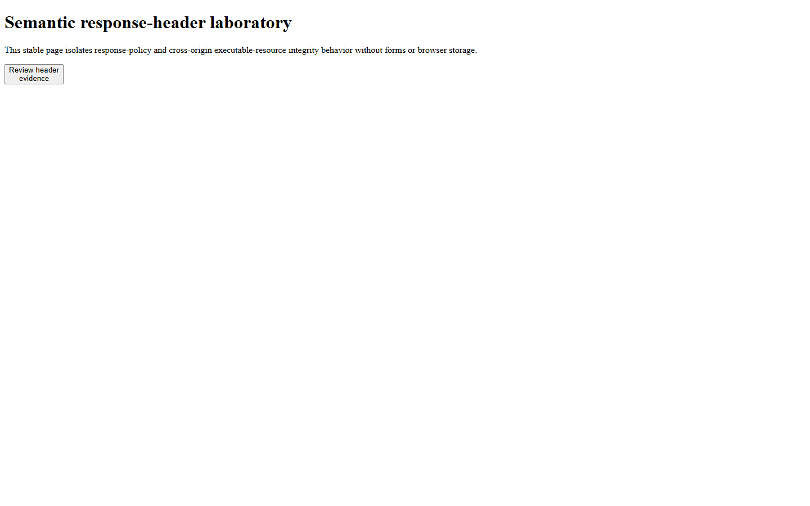

# RealityCheck report

- **Score:** 80/100
- **Target:** `http://127.0.0.1:4193/broken`
- **Mode:** quick
- **Adapter:** project-playwright (fresh-context)
- **Run:** `20260804T224609Z-a2cd9c`
- **Threshold:** major - FAILED

> Automated checks cover only the recorded scenarios and cannot prove the absence of bugs or complete WCAG compliance.

## Release gate reasons

- 5 active finding(s) met the configured severity threshold; expected 0.

## Summary

| Critical | Major | Minor | Info | Baseline penalty | Chaos penalty |
| ---: | ---: | ---: | ---: | ---: | ---: |
| 0 | 5 | 0 | 0 | 20.0 | 0.0 |

## Scenarios

| Scenario | Status | Duration | Notes |
| --- | --- | ---: | --- |
| `baseline` | completed-with-findings | 900 ms | Baseline runtime findings were recorded. |
| `mobile-375` | passed | 905 ms | Evaluated 375×812; touch-target checks were enabled. |
| `long-text` | passed | 1313 ms | 1 deterministic text mutations were applied. |
| `rtl-arabic` | passed | 1292 ms | Directionality stress test only; translation quality was not assessed. |
| `image-failure` | passed | 909 ms | Expected image request aborts were excluded from failed-request findings. |
| `keyboard-tab` | passed | 1027 ms | No controls were activated or submitted. |

## Findings

### Security header does not satisfy the reviewed value policy: content-security-policy

`RC-D296A901BC` | **MAJOR** | high confidence | existing | `baseline`

The final document response failed 2 semantic requirement(s): required CSP directives are missing: base-uri, form-action, frame-ancestors; forbidden CSP source tokens are present: 'unsafe-eval'. The raw header value was not retained.

- Rule: `security-header-policy-content-security-policy`
- URL: `http://127.0.0.1:4193/broken`

Measurements:

    {
      "facts": {
        "directiveCount": 2,
        "directiveNames": [
          "default-src",
          "script-src"
        ],
        "forbiddenTokens": [
          "'unsafe-eval'"
        ],
        "missingDirectives": [
          "base-uri",
          "form-action",
          "frame-ancestors"
        ]
      },
      "header": "content-security-policy",
      "rawValueRetained": false,
      "violations": [
        "missing-required-directive",
        "forbidden-source-token"
      ]
    }

Evidence:

- **response-header-policy:** {"facts": {"directiveCount": 2, "directiveNames": ["default-src", "script-src"], "forbiddenTokens": ["'unsafe-eval'"], "missingDirectives": ["base-uri", "form-action", "frame-ancestors"]}, "header": "content-security-policy", "rawValueRetained": false, "violations": ["missing-required-directive", "forbidden-source-token"]}

Reproduce:

1. Open the page in a fresh context.
2. Evaluate bounded semantic facts from the content-security-policy header without retaining its raw value.

Recommended fix:

Configure a reviewed CSP: add the required directives base-uri, form-action, frame-ancestors; remove the forbidden source tokens 'unsafe-eval'. Validate application behavior in staging instead of copying a permissive placeholder.
- Do not weaken the configured rule or add a permissive placeholder only to clear the gate.

---

### Security header does not satisfy the reviewed value policy: permissions-policy

`RC-9DFD5F9C8E` | **MAJOR** | high confidence | existing | `baseline`

The final document response failed 1 semantic requirement(s): these browser features do not use an empty allowlist: camera, geolocation. The raw header value was not retained.

- Rule: `security-header-policy-permissions-policy`
- URL: `http://127.0.0.1:4193/broken`

Measurements:

    {
      "facts": {
        "declaredFeatures": [
          "camera",
          "microphone"
        ],
        "disabledFeatures": [
          "microphone"
        ],
        "missingDisabledFeatures": [
          "camera",
          "geolocation"
        ]
      },
      "header": "permissions-policy",
      "rawValueRetained": false,
      "violations": [
        "feature-not-disabled"
      ]
    }

Evidence:

- **response-header-policy:** {"facts": {"declaredFeatures": ["camera", "microphone"], "disabledFeatures": ["microphone"], "missingDisabledFeatures": ["camera", "geolocation"]}, "header": "permissions-policy", "rawValueRetained": false, "violations": ["feature-not-disabled"]}

Reproduce:

1. Open the page in a fresh context.
2. Evaluate bounded semantic facts from the permissions-policy header without retaining its raw value.

Recommended fix:

After confirming the route does not need them, set these features to the empty allowlist (): camera, geolocation.
- Do not weaken the configured rule or add a permissive placeholder only to clear the gate.

---

### Security header does not satisfy the reviewed value policy: referrer-policy

`RC-A90BB59806` | **MAJOR** | high confidence | existing | `baseline`

The final document response failed 1 semantic requirement(s): the effective Referrer-Policy is unsafe-url; allowed values are: no-referrer, strict-origin-when-cross-origin. The raw header value was not retained.

- Rule: `security-header-policy-referrer-policy`
- URL: `http://127.0.0.1:4193/broken`

Measurements:

    {
      "facts": {
        "allowedValues": [
          "no-referrer",
          "strict-origin-when-cross-origin"
        ],
        "effectiveValue": "unsafe-url",
        "recognizedValues": [
          "unsafe-url"
        ]
      },
      "header": "referrer-policy",
      "rawValueRetained": false,
      "violations": [
        "referrer-policy-not-allowed"
      ]
    }

Evidence:

- **response-header-policy:** {"facts": {"allowedValues": ["no-referrer", "strict-origin-when-cross-origin"], "effectiveValue": "unsafe-url", "recognizedValues": ["unsafe-url"]}, "header": "referrer-policy", "rawValueRetained": false, "violations": ["referrer-policy-not-allowed"]}

Reproduce:

1. Open the page in a fresh context.
2. Evaluate bounded semantic facts from the referrer-policy header without retaining its raw value.

Recommended fix:

After reviewing outbound navigation, set Referrer-Policy to one of these allowed values: no-referrer, strict-origin-when-cross-origin.
- Do not weaken the configured rule or add a permissive placeholder only to clear the gate.

---

### Security header does not satisfy the reviewed value policy: x-content-type-options

`RC-749EFF79DA` | **MAJOR** | high confidence | existing | `baseline`

The final document response failed 1 semantic requirement(s): X-Content-Type-Options is not exactly nosniff. The raw header value was not retained.

- Rule: `security-header-policy-x-content-type-options`
- URL: `http://127.0.0.1:4193/broken`

Measurements:

    {
      "facts": {
        "nosniff": false
      },
      "header": "x-content-type-options",
      "rawValueRetained": false,
      "violations": [
        "nosniff-required"
      ]
    }

Evidence:

- **response-header-policy:** {"facts": {"nosniff": false}, "header": "x-content-type-options", "rawValueRetained": false, "violations": ["nosniff-required"]}

Reproduce:

1. Open the page in a fresh context.
2. Evaluate bounded semantic facts from the x-content-type-options header without retaining its raw value.

Recommended fix:

Set X-Content-Type-Options to exactly nosniff on the final document response.
- Do not weaken the configured rule or add a permissive placeholder only to clear the gate.

---

### A cross-origin executable resource has no integrity proof

`RC-BA5A5DF3FB` | **MAJOR** | high confidence | existing | `baseline`

1 of 1 cross-origin script or stylesheet resource(s) had no Subresource Integrity attribute. Resource paths and integrity values were not retained.

- Rule: `security-subresource-integrity`
- URL: `http://127.0.0.1:4193/broken`

Measurements:

    {
      "examinedCrossOriginResources": 1,
      "integrityValuesRetained": false,
      "kinds": {
        "script": 1
      },
      "missingIntegrity": 1,
      "origins": [
        "http://localhost:4193"
      ],
      "resourcePathsRetained": false
    }

Evidence:

- **security-posture:** {"examinedCrossOriginResources": 1, "integrityValuesRetained": false, "kinds": {"script": 1}, "missingIntegrity": 1, "origins": ["http://localhost:4193"], "policy": "subresource-integrity", "resourcePathsRetained": false}

Reproduce:

1. Open the page in a fresh context.
2. Inspect cross-origin script and stylesheet elements for a non-empty integrity attribute without retaining its value or resource path.

Recommended fix:

Pin the reviewed third-party asset, add its cryptographic SRI digest and appropriate crossorigin mode, or self-host the versioned asset; verify behavior before release.
- Never copy a digest from an untrusted response; compute it from the exact reviewed bytes and update it only with an intentional dependency change.

---

## Coverage warnings

- Standalone audit used an already-installed system browser (150.0.7871.116).
- Automated findings remain bounded observations; review low-confidence items before fixing.
- Responsive layout was evaluated in 1 configured viewport(s); touch-target heuristics ran only where touch was enabled.
- 6 explicit response, semantic-header, origin, and form security policy setting(s) were evaluated without submitting data or retaining raw header values.

## Run metadata

- Started: 2026-08-04T22:46:09.578Z
- Finished: 2026-08-04T22:46:16.029Z
- Duration: 6438 ms
- Tool version: 0.4.0
- Schema version: 1
