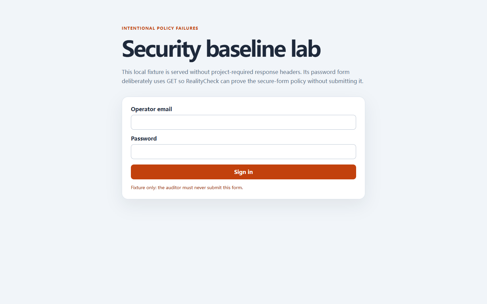

# RealityCheck report

- **Score:** 84/100
- **Target:** `http://127.0.0.1:4182/examples/security-lab/index.html`
- **Mode:** quick
- **Adapter:** project-playwright (fresh-context)
- **Run:** `20260804T163538Z-b0b154`
- **Threshold:** major - FAILED

> Automated checks cover only the recorded scenarios and cannot prove the absence of bugs or complete WCAG compliance.

## Release gate reasons

- 4 active finding(s) met the configured severity threshold; expected 0.

## Summary

| Critical | Major | Minor | Info | Baseline penalty | Chaos penalty |
| ---: | ---: | ---: | ---: | ---: | ---: |
| 0 | 4 | 0 | 0 | 16.0 | 0.0 |

## Scenarios

| Scenario | Status | Duration | Notes |
| --- | --- | ---: | --- |
| `baseline` | completed-with-findings | 720 ms | Baseline runtime findings were recorded. |
| `mobile-375` | passed | 618 ms | - |
| `long-text` | passed | 1143 ms | 2 deterministic text mutations were applied. |
| `rtl-arabic` | passed | 1216 ms | Directionality stress test only; translation quality was not assessed. |
| `image-failure` | passed | 677 ms | Expected image request aborts were excluded from failed-request findings. |
| `keyboard-tab` | passed | 822 ms | No controls were activated or submitted. |

## Findings

### Required security header is missing: content-security-policy

`RC-D424F2C1C9` | **MAJOR** | high confidence | existing | `baseline`

The final document response did not include the project-required content-security-policy header.

- Rule: `security-header-content-security-policy`
- URL: `http://127.0.0.1:4182/examples/security-lab/index.html`

Measurements:

    {
      "header": "content-security-policy",
      "present": false,
      "responseStatus": 200
    }

Evidence:

- **response-policy:** {"header": "content-security-policy", "present": false, "status": 200}

Reproduce:

1. Open the page in a fresh context.
2. Inspect the final document response for the content-security-policy header.

Recommended fix:

Configure the application or trusted edge to emit a reviewed content-security-policy policy on this route.
- Test the actual policy in a staging environment; do not add a permissive placeholder only to satisfy the check.

---

### Required security header is missing: referrer-policy

`RC-DCC68313A4` | **MAJOR** | high confidence | existing | `baseline`

The final document response did not include the project-required referrer-policy header.

- Rule: `security-header-referrer-policy`
- URL: `http://127.0.0.1:4182/examples/security-lab/index.html`

Measurements:

    {
      "header": "referrer-policy",
      "present": false,
      "responseStatus": 200
    }

Evidence:

- **response-policy:** {"header": "referrer-policy", "present": false, "status": 200}

Reproduce:

1. Open the page in a fresh context.
2. Inspect the final document response for the referrer-policy header.

Recommended fix:

Configure the application or trusted edge to emit a reviewed referrer-policy policy on this route.
- Test the actual policy in a staging environment; do not add a permissive placeholder only to satisfy the check.

---

### Required security header is missing: x-content-type-options

`RC-3A8DEE4287` | **MAJOR** | high confidence | existing | `baseline`

The final document response did not include the project-required x-content-type-options header.

- Rule: `security-header-x-content-type-options`
- URL: `http://127.0.0.1:4182/examples/security-lab/index.html`

Measurements:

    {
      "header": "x-content-type-options",
      "present": false,
      "responseStatus": 200
    }

Evidence:

- **response-policy:** {"header": "x-content-type-options", "present": false, "status": 200}

Reproduce:

1. Open the page in a fresh context.
2. Inspect the final document response for the x-content-type-options header.

Recommended fix:

Configure the application or trusted edge to emit a reviewed x-content-type-options policy on this route.
- Test the actual policy in a staging environment; do not add a permissive placeholder only to satisfy the check.

---

### A sensitive form uses an insecure submission path

`RC-50F5B5802D` | **MAJOR** | high confidence | existing | `baseline`

1 form(s) could expose credentials through GET or an insecure transport.

- Rule: `security-insecure-form`
- URL: `http://127.0.0.1:4182/examples/security-lab/index.html`

Measurements:

    {
      "forms": [
        {
          "actionOrigin": "http://127.0.0.1:4182",
          "actionProtocol": "http:",
          "hasPassword": "[REDACTED]",
          "index": 0,
          "method": "get"
        }
      ]
    }

Evidence:

- **security-posture:** {"forms": [{"actionOrigin": "http://127.0.0.1:4182", "actionProtocol": "http:", "hasPassword": "[REDACTED]", "index": 0, "method": "get"}], "policy": "secure-forms"}

Reproduce:

1. Open the page in a fresh context.
2. Inspect password fields, form methods, and resolved action protocols without submitting anything.

Recommended fix:

Use POST for credentials and submit only to a reviewed HTTPS endpoint.

---

## Coverage warnings

- Standalone audit used an already-installed system browser (150.0.7871.116).
- Automated findings remain bounded observations; review low-confidence items before fixing.
- 5 explicit response, origin, and form security policy setting(s) were evaluated without submitting data.

## Run metadata

- Started: 2026-08-04T16:35:38.058Z
- Finished: 2026-08-04T16:35:43.360Z
- Duration: 5282 ms
- Tool version: 0.4.0
- Schema version: 1
