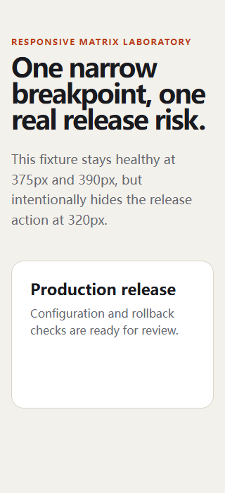

# RealityCheck report

- **Score:** 92/100
- **Target:** `http://127.0.0.1:4182/examples/viewport-lab/broken.html`
- **Mode:** quick
- **Adapter:** project-playwright (fresh-context)
- **Run:** `20260804T192344Z-7e2cb7`
- **Threshold:** major - FAILED

> Automated checks cover only the recorded scenarios and cannot prove the absence of bugs or complete WCAG compliance.

## Release gate reasons

- 1 active finding(s) met the configured severity threshold; expected 0.

## Summary

| Critical | Major | Minor | Info | Baseline penalty | Chaos penalty |
| ---: | ---: | ---: | ---: | ---: | ---: |
| 0 | 1 | 0 | 0 | 0.0 | 8.0 |

## Scenarios

| Scenario | Status | Duration | Notes |
| --- | --- | ---: | --- |
| `baseline` | passed | 600 ms | - |
| `phone-320` | completed-with-findings | 613 ms | Evaluated 320×700; touch-target checks were enabled. |
| `phone-390` | passed | 607 ms | Evaluated 390×844; touch-target checks were enabled. |
| `tablet-768` | passed | 661 ms | Evaluated 768×1024; touch-target checks were enabled. |
| `long-text` | passed | 1121 ms | 3 deterministic text mutations were applied. |
| `rtl-arabic` | passed | 1104 ms | Directionality stress test only; translation quality was not assessed. |
| `image-failure` | passed | 639 ms | Expected image request aborts were excluded from failed-request findings. |
| `keyboard-tab` | passed | 770 ms | No controls were activated or submitted. |

## Findings

### Review release is outside the phone-320 viewport

`RC-C735CB3F02` | **MAJOR** | high confidence | new | `phone-320`

A control available at desktop width is fully outside the 320px viewport.

- Rule: `offscreen-critical-control`
- URL: `http://127.0.0.1:4182/examples/viewport-lab/broken.html`
- Element: `[data-testid="release-action"]`

Measurements:

    {
      "boundingBox": {
        "bottom": 553,
        "height": 44,
        "right": 559,
        "width": 156,
        "x": 403,
        "y": 509
      },
      "documentScrollWidth": 320,
      "overflowPixels": 0,
      "touch": true,
      "viewportHeight": 700,
      "viewportId": "phone-320",
      "viewportWidth": 320
    }

Evidence:

- **dom:** {"boundingBox": {"bottom": 553, "height": 44, "right": 559, "width": 156, "x": 403, "y": 509}, "selector": "[data-testid=\"release-action\"]"}

Reproduce:

1. Open the page with the phone-320 320×700 viewport.
2. Locate Review release without horizontal scrolling.

Recommended fix:

Keep the control in normal responsive flow at this breakpoint.
- Remove fixed minimum widths and stack actions below headings when space is constrained.

---

## Coverage warnings

- Standalone audit used an already-installed system browser (150.0.7871.116).
- Automated findings remain bounded observations; review low-confidence items before fixing.
- Responsive layout was evaluated in 3 configured viewport(s); touch-target heuristics ran only where touch was enabled.

## Run metadata

- Started: 2026-08-04T19:23:44.306Z
- Finished: 2026-08-04T19:23:50.542Z
- Duration: 6221 ms
- Tool version: 0.4.0
- Schema version: 1
