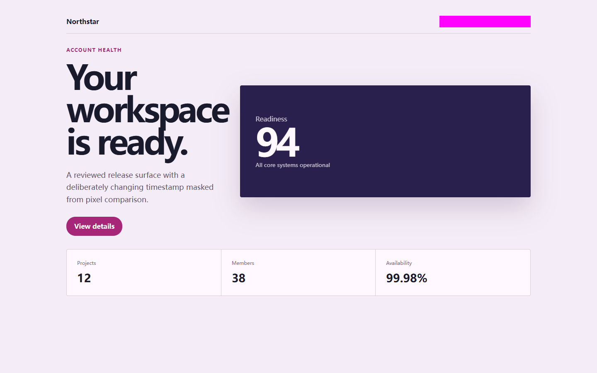
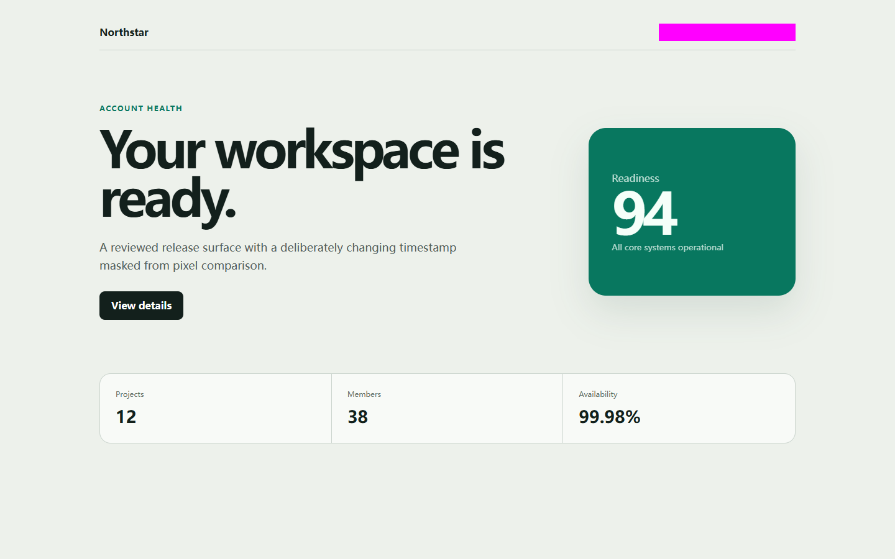
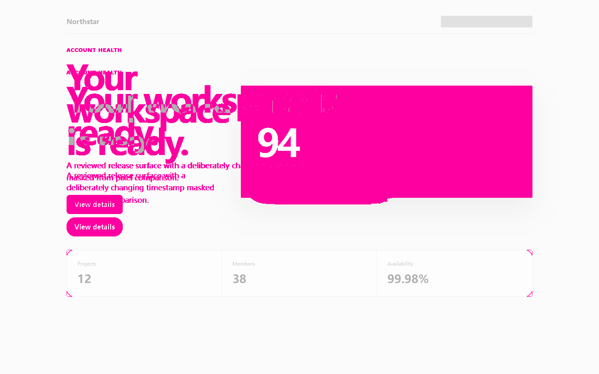

# RealityCheck report

- **Score:** 96/100
- **Target:** `http://127.0.0.1:4183/index.html`
- **Mode:** quick
- **Adapter:** project-playwright (fresh-context)
- **Run:** `20260804T183414Z-db76fb`
- **Threshold:** major - FAILED

> Automated checks cover only the recorded scenarios and cannot prove the absence of bugs or complete WCAG compliance.

## Release gate reasons

- 1 active finding(s) met the configured severity threshold; expected 0.

## Summary

| Critical | Major | Minor | Info | Baseline penalty | Chaos penalty |
| ---: | ---: | ---: | ---: | ---: | ---: |
| 0 | 1 | 0 | 0 | 4.0 | 0.0 |

## Scenarios

| Scenario | Status | Duration | Notes |
| --- | --- | ---: | --- |
| `baseline` | completed-with-findings | 787 ms | Baseline runtime findings were recorded. |
| `mobile-375` | passed | 2051 ms | - |
| `long-text` | passed | 1191 ms | 7 deterministic text mutations were applied. |
| `rtl-arabic` | passed | 1039 ms | Directionality stress test only; translation quality was not assessed. |
| `image-failure` | passed | 671 ms | Expected image request aborts were excluded from failed-request findings. |
| `keyboard-tab` | passed | 808 ms | No controls were activated or submitted. |

## Findings

### Current rendering differs from the approved visual baseline

`RC-F9DFD0AFA5` | **MAJOR** | high confidence | existing | `baseline`

245,207 pixel(s) changed (18.920%); the approved maximum is 0.200%.

- Rule: `visual-regression-threshold`
- URL: `http://127.0.0.1:4183/index.html`
- Element: `html`

Measurements:

    {
      "baselineHeight": 900,
      "baselineWidth": 1440,
      "changedPixels": 245207,
      "currentHeight": 900,
      "currentWidth": 1440,
      "diffRatio": 0.18920293209876543,
      "dimensionsMatch": true,
      "maskedSelectors": 1,
      "maxDiffRatio": 0.002,
      "pixelThreshold": 28,
      "totalPixels": 1296000
    }

Evidence:

- **visual-policy:** {"baselineHeight": 900, "baselineWidth": 1440, "changedPixels": 245207, "currentHeight": 900, "currentWidth": 1440, "diffRatio": 0.18920293209876543, "dimensionsMatch": true, "maskedSelectors": 1, "maxDiffRatio": 0.002, "pixelThreshold": 28, "state": "failed", "totalPixels": 1296000}

Reproduce:

1. Open the route in the same clean desktop viewport.
2. Compare visual-current.png, visual-approved.png, and visual-diff.png.

Recommended fix:

Repair the unintended application-owned rendering change and rerun the audit. If the change is intentional, review it and explicitly replace the baseline with visual-approve --replace-baseline.
- Do not raise the threshold or overwrite the baseline solely to clear the gate.

---

## Coverage warnings

- Standalone audit used an already-installed system browser (150.0.7871.116).
- Automated findings remain bounded observations; review low-confidence items before fixing.
- Visual regression policy finished with failed state using 1 declared mask(s); baseline replacement always requires an explicit approval command.

## Run metadata

- Started: 2026-08-04T18:34:14.967Z
- Finished: 2026-08-04T18:34:21.617Z
- Duration: 6631 ms
- Tool version: 0.4.0
- Schema version: 1
